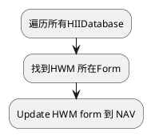

NAVIGATION
![[1aedda09f8e2a5d07480fa3919cc23d.png]]
右下角红框为NAVIGATION 导航

这个是效果图，原本显示为
![[7e4c18c096d1cd4eaf1d53aa3db43f8.jpg]]
Code里通过这几个函数实现NAV更新
```C
/**
    function to draw a page with attributes
    @param page
    @retval status
**/
extern UINTN gSetupStatus;

EFI_STATUS PageDraw( PAGE_DATA *page )
{
//  UINT32  i, PageNum, MainFrameIndex=0, CurrentControl;
    UINT32  i,  MainFrameIndex=0, CurrentControl;
    FRAME_DATA *MainFrame = NULL;

    CONTROL_DATA **control;
    
    UINTN BackUpSetupStatus = gSetupStatus;
    gSetupStatus = TSE_SETUP_STATUS_BLOCK_PACKUPDATEPROCESS;
    MainFrameIndex =StyleFrameIndexOf(MAIN_FRAME);
    MainFrame = page->FrameList[MainFrameIndex];

    StyleBeforeFrame( MainFrame ) ;

    // update the help for the current selection
    _PageUpdateHelp( page );
    _PageUpdateTitle( page );
    _PageUpdateSubtitle( page );
    _PageUpdateNavStrings( page );
    _PageUpdateFrameStrings( page );

//  PageNum = gApp->CurrentPage ; // PageNum Set unused
    //Call Oem hooks to decide item focus on complete redraw
    if(gApp->CompleteRedraw && gApp->OnRedraw) {
        if(gApp->OnRedraw == MENU_COMPLETE_REDRAW)
            StylePageItemFocus(page, MainFrame);
        else if(gApp->OnRedraw == SUBMENU_COMPLETE_REDRAW)
            StyleSubPageItemFocus(page, MainFrame);
        else if(gApp->OnRedraw == DEACTIVATE_CONTROLS)
        {
            DeactivateControls(page);
        }
        gApp->OnRedraw = 0 ;
    }


    //If there is an active control in Main frame only draw that frame
    if(MainFrame->CurrentControl == FRAME_NONE_FOCUSED)
        control = NULL;
    else
        control = &MainFrame->ControlList[MainFrame->CurrentControl];
    if ( control != NULL )
    {
        //If a control is active only draw that
        if( (*control) && (*control)->ControlActive == TRUE )
        {
            StyleBeforeFrame( MainFrame ) ;
            gFrame.Draw( MainFrame );
            gSetupStatus = BackUpSetupStatus;
            return EFI_SUCCESS;
        }
    }

    // Backup the MainFrame->CurrentControl
    CurrentControl = MainFrame->CurrentControl;
    for ( i = 0; i < page->FrameCount; i++ )
    {
        StyleBeforeFrame( page->FrameList[i] ) ;
        gFrame.Draw( page->FrameList[i] );
        if(i == MainFrameIndex)
        {
            // After expression evalution if current control is affected
            if(MainFrame->CurrentControl != CurrentControl)
            {
                // Help might be updated
                _PageUpdateHelp( page );
                CurrentControl = MainFrame->CurrentControl;
                i = 0; // Redraw all the frames again
            }
        }
    }

    gSetupStatus = BackUpSetupStatus;
    return EFI_SUCCESS;
}

/**
    function to update the title of the page
    @param page
    @retval void
**/
VOID _PageUpdateNavStrings( PAGE_DATA *page )
{
    _PageUpdateMemo( page, NAV_FRAME, gHiiHandle, StyleGetNavToken( page->PageData.PageID ) );
}

//<AMI_PHDR_START>
//----------------------------------------------------------------------------
// Procedure:   StyleGetNavToken    
//
// Description: Function to get navigation token
//
// Input:       UINT32 page
//
// Output:      UINT16 token number
//
//----------------------------------------------------------------------------
//<AMI_PHDR_END>
UINT16 StyleGetNavToken( UINT32 page )
{
    UINT16 i=0 ;    

    #ifdef STYLE_OEM_NAV_TOKEN                      
        i = OEMStyleGetNavToken(page );
    #else
        #ifdef STYLE_OVERRIDE_NAV_TOKEN
            i = OverRideStyleGetNavToken(page);
        #endif
    #endif      
    return i ;
}
//<AMI_PHDR_START>
//----------------------------------------------------------------------------
// Procedure:   OverRideStyleGetNavToken    
//
// Description: Function to get navigation frame token
//
// Input:       UINT32 page number
//
// Output:      UINT16 token
//
//----------------------------------------------------------------------------
//<AMI_PHDR_END></AMI_PHDR_END>
UINT16 OverRideStyleGetNavToken( UINT32 page )
{
    return gStrNavToken;
}

UINT16 gStrNavToken = STRING_TOKEN(STR_NAV_STRINGS_3);

#string STR_NAV_STRINGS_2        #language    zho    "→←: 选择画面\n↑↓: 选择项目\nEnter: 选择\n+/-: 变更\nF1: 一般性提示\nF2: 之前设定值\nF9: 最佳化预设值\nF10: 储存并重启\nESC: 离开"

```

我现在所想到的思路：


