```mermaid
graph TD
    classDef startend fill:#F5EBFF,stroke:#BE8FED,stroke-width:2px;
    classDef process fill:#E5F6FF,stroke:#73A6FF,stroke-width:2px;
    classDef decision fill:#FFF6CC,stroke:#FFBC52,stroke-width:2px;
    
    A([开始]):::startend --> B(初始化变量):::process
    B --> C(初始化驱动库):::process
    C --> D(记录调试信息 entry):::process
    D --> E{SetupEntryHook 返回 TRUE?}:::decision
    E -- 是 --> F([返回 EFI_UNSUPPORTED]):::startend
    E -- 否 --> G(根据宏条件加载字符串):::process
    G --> H(获取 PCD 指针):::process
    H --> I(初始化 HII 协议):::process
    I --> J{协议初始化失败?}:::decision
    J -- 是 --> K([返回错误状态]):::startend
    J -- 否 --> L(覆盖标题字符串):::process
    L --> M(记录调试信息 screen):::process
    M --> N(初始化屏幕缓冲区):::process
    N --> O{IsTSEGopNotificationSupport?}:::decision
    O -- 是 --> P{IsTseGopNotificiationFuncitonInstalled?}:::decision
    P -- 否 --> Q(设置 GOP 通知):::process
    Q --> R(设置 IsTseGopNotificiationFuncitonInstalled = TRUE):::process
    P -- 是 --> S(记录调试信息 guid):::process
    R --> S
    O -- 否 --> S
    S --> T(初始化应用数据):::process
    T --> U{应用数据初始化失败?}:::decision
    U -- 是 --> V(调用 MiniSetupExit):::process
    V --> W([返回 MiniSetupExit 结果]):::startend
    U -- 否 --> X(记录调试信息 globals):::process
    X --> Y(初始化全局指针):::process
    Y --> Z(更新屏幕参数):::process
    Z --> AA(加载变量):::process
    AA --> AB{变量加载失败?}:::decision
    AB -- 是 --> K
    AB -- 否 --> AC{是否为应用程序构建?}:::decision
    AC -- 是 --> AD(获取命令行参数):::process
    AC -- 否 --> AE(执行钩子函数):::process
    AD --> AE
    AE --> AF(设置 gPostStatus):::process
    AF --> AG{是否为独立应用?}:::decision
    AG -- 是 --> AH(调用 PostManagerHandshake):::process
    AG -- 否 --> AI(调用 BootGetLanguages):::process
    AI --> AJ(InstallProtocol):::process
    AJ --> AK(RegisterNotification):::process
    AK --> AL{RegisterNotification失败?}:::decision
    AL -- 是 --> AM(卸载协议):::process
    AL -- 否 --> AN(检查默认密码支持):::process
    AM --> AN
    AH --> AN
    AN --> AO{支持默认密码?}:::decision
    AO -- 是 --> AP(获取 FirstBoot):::process
    AP --> AQ{FirstBoot 为 NULL?}:::decision
    AQ -- 是 --> AR(设置默认密码):::process
    AR --> AS(设置 TseFirstBootFlag):::process
    AS --> AT(释放 FirstBoot 内存):::process
    AQ -- 否 --> AT
    AO -- 否 --> AU([返回 Status]):::startend
    AT --> AU
```

AMITSE is a firmware component that allows the user to manage platform configuration through setup pages and provides boot manager capabilities.

AMITsePkg 结构
```C
AMITsePkg
├─Board
│  └─Em
│      └─AMITSEBoard
├─Core
│  └─em
│      └─AMITSE
│          ├─Inc
│          └─SignOn
├─EDK
│  └─MiniSetup
│      ├─BootOnly
│      │  ├─AMILogo
│      │  └─PasswordEncode
│      ├─Ezport
│      ├─EzportPlus
│      ├─GTSE
│      │  ├─GcExt
│      │  └─GtseSkin
│      ├─JsonCapsule
│      ├─Legacy
│      ├─TseAdvanced
│      │  └─AdvancedImages
│      ├─TseLite
│      │  └─StyleHook
│      ├─TseOEM
│      └─uefi2.1
├─Include
│  └─Protocol
├─Library
│  ├─AmiProgressReportLib
│  ├─FileBrowser
│  └─PasswordEncodeSmm
└─TseEDKIIPkg
```

整个模块的入口：

`AmiTsePkg\EDK\MiniSetup\BootOnly\minisetup.c`
```C
EFI_DRIVER_ENTRY_POINT (MiniSetupApplication)

/**
    This function is the entry point for TSE. It loads
    resources like strings and setup-data. It registers
    notification for console protocols. It Installs TSE
    protocols.

    @param ImageHandle 
    @param SystemTable 

    @retval Return Status based on errors that occurred in library
        functions.
**/
EFI_STATUS MiniSetupApplication (
		EFI_HANDLE ImageHandle,
		EFI_SYSTEM_TABLE *SystemTable )
{
	EFI_STATUS	Status;
    UINTN 		OptionSize = 0;
    void 		*FirstBoot = NULL;
    EFI_GUID	TseFirstBootGuid = TSE_FIRST_BOOT_GUID;
    
	gImageHandle = ImageHandle;

	EfiInitializeDriverLib ( ImageHandle, SystemTable );
	
	RUNTIME_DEBUG( L"entry" );
	if(TRUE == SetupEntryHook())
		return EFI_UNSUPPORTED;
#if APTIO_4_00 || SETUP_USE_GUIDED_SECTION
#if TSE_USE_EDK_LIBRARY
	LoadStrings(ImageHandle,&gHiiHandle);
#else
#if TSE_BUILD_AS_APPLICATION	
	TSELoadStrings (ImageHandle,(EFI_HII_HANDLE*)&gHiiHandle);
#else
	LoadStrings (ImageHandle,(EFI_HII_HANDLE*)&gHiiHandle);
#endif	
#endif
#else
#ifdef USE_DEPRICATED_INTERFACE
	// Read in the strings from the GUIDed section
	Status = LoadStringsDriverLib( ImageHandle, &STRING_ARRAY_NAME );
	if ( EFI_ERROR( Status ) )
	{
		return Status;
	}
#endif

	Status = InitMiniSetupStrings();
	if ( EFI_ERROR( Status ) )
	{
		return Status;
	}
#endif
	gEfiShellFileGuid = TSEGetPCDptr();
	Status = HiiInitializeProtocol();
	if ( EFI_ERROR ( Status ) )
		return Status;

	//Override the STR_MAIN_TITLE and STR_MAIN_COPYRIGHT tokens to avoid the changes from uni.
	OverrideTitleString();
	
	// initialize screen buffer
	RUNTIME_DEBUG( L"screen" );
	InitializeScreenBuffer( EFI_BACKGROUND_BLACK | EFI_LIGHTGRAY );
	if(IsTSEGopNotificationSupport())
	{
		if(!IsTseGopNotificiationFuncitonInstalled)
		{
			NotificatonFunctionForGop();
			IsTseGopNotificiationFuncitonInstalled =TRUE;
		}
	}
	RUNTIME_DEBUG( L"guid" );

	Status = InitApplicationData(ImageHandle);
	if ( EFI_ERROR( Status ) )
	{
		return MiniSetupExit( Status );
	}

	RUNTIME_DEBUG( L"globals" );
	InitGlobalPointers();
    UpdategScreenParams ();

	Status = VarLoadVariables( (VOID **)&gVariableList, NULL );
	if ( EFI_ERROR( Status ) )
	{
		return Status;
	}
#if TSE_BUILD_AS_APPLICATION
	GetArgumentsFromImage (ImageHandle, &gArgv, &gArgCount);
#endif	
    MinisetupDriverEntryHookHook();

	gPostStatus = TSE_POST_STATUS_BEFORE_POST_SCREEN;

#ifndef STANDALONE_APPLICATION
	// Install our handshake protocol
    BootGetLanguages();
	InstallProtocol();

	// Register any notification 'callbacks' that we need
	Status = RegisterNotification();
	if ( EFI_ERROR( Status ) )
		UninstallProtocol();
#else
	PostManagerHandshake();
#endif // STANDALONE_APPLICATION

    if (TseDefaultSetupPasswordSupported ())
    {
    	FirstBoot = (BOOT_OPTION *)VarGetNvramName (L"TseFirstBootFlag", &TseFirstBootGuid, NULL, &OptionSize);
    	if (NULL == FirstBoot)
    	{
    		SetDefaultPassword (); //Get default password, if any present in SDL, and set default pass to NVRAM 
    		VarSetNvramName( L"TseFirstBootFlag", &TseFirstBootGuid, EFI_VARIABLE_BOOTSERVICE_ACCESS | EFI_VARIABLE_NON_VOLATILE, &OptionSize, sizeof (OptionSize) );
    	}
    	if(FirstBoot) //For MemoryLeak Fix
    		MemFreePointer((void **) &FirstBoot);
    }
	return Status;
}

```


---
MiniSetupApplication中两个重要的模块：
`InstallProtocol`和`RegisterNotification`
### `InstallProtocol`:
`AmiTsePkg\EDK\MiniSetup\BootOnly\protocol.c`
```C
/**
    This function installs different protocols exported.
    @param VOID
    @retval Return Status based on errors that occurred in library
        functions.
**/
EFI_STATUS InstallProtocol( VOID )
{
	EFI_STATUS Status;

	Status = gBS->InstallMultipleProtocolInterfaces(
			&gProtocolHandle,
			&gAmiPostManagerProtocolGuid, &gPostManagerProtocol,
#ifdef USE_COMPONENT_NAME
			&gEfiComponentNameProtocolGuid, &gComponentName,
#endif
			NULL
			);
	if ( !EFI_ERROR( Status ) )
	{
		Status = InstallFormBrowserProtocol(gProtocolHandle);
		Status = InstallInvalBGRTStatusProtocol (gProtocolHandle);
		Status = InstallScreenMgmtProtocol (gProtocolHandle);
		Status = InstallHiiPopupProtocol(gProtocolHandle);
	}

	return Status;
}
```

InstallProtocol会安装
[[AMI POST Manager Protocol]]
`TSE_INVALIDATE_BGRT_STATUS_PROTOCOL`
`EFI_FORM_BROWSER2_PROTOCOL`
`AMI_TSE_SCREEN_MGMT_PROTOCOL`
`EFI_HII_POPUP_PROTOCOL`

---
#### RegisterNotification
[[RegisterNotification]]
