# AmiTsePkg/SkiaPkg 刷新机制详细分析

## 1. 刷新机制概述

### 1.1 刷新机制的作用和目的

AmiTsePkg/SkiaPkg 中的刷新机制是 BIOS Setup UI 的核心功能之一，主要用于：

* **实时数据更新**：确保界面显示的数据与底层 NVRAM 中的实际值保持同步

* **动态控件状态变化**：根据系统状态或用户操作动态更新控件的可见性、可用性等属性

* **用户交互响应**：为需要定期更新的控件（如时间、日期、状态监控等）提供自动刷新能力

* **数据一致性保证**：防止因缓存与实际存储不一致导致的数据错误

### 1.2 在 BIOS Setup UI 中的重要性

刷新机制在 BIOS Setup UI 中扮演着关键角色：

1. **保证数据准确性**：确保用户看到的是最新的配置值
2. **提升用户体验**：自动更新避免用户手动刷新页面
3. **支持动态配置**：允许某些配置项根据其他设置的变化而自动调整
4. **实现实时监控**：支持系统状态的实时显示和监控

### 1.3 与 CreateSetupTreeNode 函数的关系

刷新机制与 `CreateSetupTreeNode` 函数紧密相关：

* **初始化阶段**：在 `CreateSetupTreeNode` 中为每个控件设置初始的 `Interval` 值

* **运行时管理**：通过 `UpdateIntrevalforRefreshControls` 函数管理刷新周期

* **状态同步**：刷新时调用 `UpdateControlSet` 更新整个控件树的状态

## 2. 核心函数分析

### 2.1 UpdateIntrevalforRefreshControls 函数详细分析

```cpp
void UpdateIntrevalforRefreshControls(GUI_CTRL_INFO_NODE *TreeNode, BOOLEAN *Change)
{
    GUI_CTRL_INFO_NODE *CtrlNode = TreeNode;
    UINT16 Value = 0;
    
    // 检查控件句柄是否有效
    if (((CONTROL_HANDLE *)(CtrlNode->CtrlHandle)))
    {
        // 检查是否设置了刷新间隔
        if (((CONTROL_HANDLE *)(CtrlNode->CtrlHandle))->Interval)
        {
            // 递减间隔计数器，当归零时触发刷新
            if (--(((CONTROL_HANDLE *)(CtrlNode->CtrlHandle))->Interval) == 0)
            {
                EFI_STATUS Status = EFI_UNSUPPORTED;
                
                if (((CONTROL_HANDLE *)(CtrlNode->CtrlHandle))->CtrlHandle)
                {
                    // 根据控件类型重新设置间隔值
                    if ((((CONTROL_INFO *)(((CONTROL_HANDLE *)(CtrlNode->CtrlHandle))->CtrlHandle))->ControlType == CONTROL_TYPE_DATE) || 
                        (((CONTROL_INFO *)(((CONTROL_HANDLE *)(CtrlNode->CtrlHandle))->CtrlHandle))->ControlType == CONTROL_TYPE_TIME))
                    {
                        // DATE/TIME 控件：ControlRefresh / 5
                        (((CONTROL_HANDLE *)(CtrlNode->CtrlHandle))->Interval) = 
                            (UINT8)(((CONTROL_INFO *)(((CONTROL_HANDLE *)(CtrlNode->CtrlHandle))->CtrlHandle))->ControlFlags.ControlRefresh) / 5;
                    }
                    else if (((CONTROL_INFO *)(((CONTROL_HANDLE *)(CtrlNode->CtrlHandle))->CtrlHandle))->ControlType == CONTROL_TYPE_ACTION)
                    {
                        // ACTION 控件特殊处理
                        Value = UefiTseLiteGetAmiCallbackIndex(
                            ((CONTROL_INFO *)(((CONTROL_HANDLE *)(CtrlNode->CtrlHandle))->CtrlHandle))->ControlConditionalPtr, 
                            ((CONTROL_INFO *)(((CONTROL_HANDLE *)(CtrlNode->CtrlHandle))->CtrlHandle))->ControlPtr);
                        
                        if (Value == INTERACTIVE_TEXT_VALUE)
                        {
                            // 处理交互式文本回调
                            _ProcessActionCallback(((CONTROL_INFO *)((CONTROL_HANDLE *)(CtrlNode->CtrlHandle))->CtrlHandle), TRUE);
                            (((CONTROL_HANDLE *)(CtrlNode->CtrlHandle))->Interval) = 
                                (((CONTROL_INFO *)(((CONTROL_HANDLE *)(CtrlNode->CtrlHandle))->CtrlHandle))->ControlFlags.ControlRefresh);
                            *Change = UpdateControlGroup(gCurrentPage->Child, TRUE);
                        }
                    }
                    else
                    {
                        // 其他控件：ControlRefresh / 10
                        (((CONTROL_HANDLE *)(CtrlNode->CtrlHandle))->Interval) = 
                            (UINT8)(((CONTROL_INFO *)(((CONTROL_HANDLE *)(CtrlNode->CtrlHandle))->CtrlHandle))->ControlFlags.ControlRefresh) / 10;
                    }

                    // 刷新控件的 NVRAM 值
                    Status = UefiRefershQuestionValueNvRAM(((CONTROL_INFO *)(((CONTROL_HANDLE *)(CtrlNode->CtrlHandle))->CtrlHandle)));

                    if (!EFI_ERROR(Status))
                    {
                        *Change = TRUE;
                        // 更新父节点及其所有子节点的状态和值
                        if (CtrlNode->Parent)
                        {
                            UpdateControlSet(CtrlNode->Parent, FALSE);
                        }
                    }
                }
            }
        }
    }

    // 递归处理子节点
    CtrlNode = CtrlNode->Child;
    while (CtrlNode)
    {
        UpdateIntrevalforRefreshControls(CtrlNode, Change);
        CtrlNode = CtrlNode->Next;
    }
}
```

**函数功能分析：**

1. **递减计数器**：每次调用时将 `Interval` 值递减 1
2. **触发刷新**：当 `Interval` 归零时执行刷新操作
3. **重置间隔**：根据控件类型重新计算并设置 `Interval` 值
4. **更新数据**：调用 `UefiRefershQuestionValueNvRAM` 从 NVRAM 获取最新值
5. **同步状态**：通过 `UpdateControlSet` 更新控件树的状态
6. **递归遍历**：遍历整个控件树确保所有控件都被处理

#### 2.1.1 函数参数详细分析

**参数说明：**

1. **TreeNode (GUI_CTRL_INFO_NODE \*)**
   - **作用**：指向控件树节点的指针，表示当前要处理的控件节点
   - **数据结构**：包含控件句柄、父节点、子节点、兄弟节点等信息
   - **传递方式**：按值传递指针，函数内部可以修改指针指向的内容
   - **递归特性**：在递归调用中，该参数会指向不同的子节点

2. **Change (BOOLEAN \*)**
   - **作用**：输出参数，用于标识是否有控件发生了刷新
   - **数据流向**：函数内部设置该值，调用者通过该参数获取刷新状态
   - **状态传递**：当任何控件成功刷新时，该值被设置为 TRUE
   - **全局影响**：影响后续的 GUI 视图更新决策

#### 2.1.2 控件类型差异化处理机制

**刷新间隔策略：**

1. **DATE/TIME 控件 (CONTROL_TYPE_DATE | CONTROL_TYPE_TIME)**
   ```cpp
   // 刷新间隔 = ControlRefresh / 5
   (((CONTROL_HANDLE *)(CtrlNode->CtrlHandle))->Interval) = 
       (UINT8)(((CONTROL_INFO *)(((CONTROL_HANDLE *)(CtrlNode->CtrlHandle))->CtrlHandle))->ControlFlags.ControlRefresh) / 5;
   ```
   - **设计原理**：时间日期控件需要较高的刷新频率以保持准确性
   - **刷新频率**：相对较高（除以5），确保时间显示的实时性
   - **应用场景**：BIOS 设置界面中的系统时间、日期显示

2. **ACTION 控件 (CONTROL_TYPE_ACTION)**
   ```cpp
   Value = UefiTseLiteGetAmiCallbackIndex(
       ((CONTROL_INFO *)(((CONTROL_HANDLE *)(CtrlNode->CtrlHandle))->CtrlHandle))->ControlConditionalPtr, 
       ((CONTROL_INFO *)(((CONTROL_HANDLE *)(CtrlNode->CtrlHandle))->CtrlHandle))->ControlPtr);
   
   if (Value == INTERACTIVE_TEXT_VALUE)
   {
       _ProcessActionCallback(((CONTROL_INFO *)((CONTROL_HANDLE *)(CtrlNode->CtrlHandle))->CtrlHandle), TRUE);
       (((CONTROL_HANDLE *)(CtrlNode->CtrlHandle))->Interval) = 
           (((CONTROL_INFO *)(((CONTROL_HANDLE *)(CtrlNode->CtrlHandle))->CtrlHandle))->ControlFlags.ControlRefresh);
       *Change = UpdateControlGroup(gCurrentPage->Child, TRUE);
   }
   ```
   - **特殊处理**：需要检查回调索引类型
   - **交互式文本**：当为 INTERACTIVE_TEXT_VALUE 时执行特殊处理
   - **回调执行**：调用 `_ProcessActionCallback` 处理动作回调
   - **组更新**：通过 `UpdateControlGroup` 更新整个控件组
   - **刷新间隔**：使用原始的 ControlRefresh 值（不除以任何数）

3. **其他控件类型**
   ```cpp
   // 刷新间隔 = ControlRefresh / 10
   (((CONTROL_HANDLE *)(CtrlNode->CtrlHandle))->Interval) = 
       (UINT8)(((CONTROL_INFO *)(((CONTROL_HANDLE *)(CtrlNode->CtrlHandle))->CtrlHandle))->ControlFlags.ControlRefresh) / 10;
   ```
   - **默认策略**：较低的刷新频率（除以10）
   - **性能考虑**：减少不必要的刷新以提高系统性能
   - **适用范围**：普通文本、数值、选择框等控件

#### 2.1.3 递归遍历机制深度分析

**递归实现原理：**

```cpp
// 递归处理子节点
CtrlNode = CtrlNode->Child;
while (CtrlNode)
{
    UpdateIntrevalforRefreshControls(CtrlNode, Change);  // 递归调用
    CtrlNode = CtrlNode->Next;                           // 遍历兄弟节点
}
```

**遍历策略：**

1. **深度优先遍历**：先处理当前节点，再递归处理子节点
2. **兄弟节点遍历**：在同一层级中按链表顺序遍历所有兄弟节点
3. **完整覆盖**：确保控件树中的每个节点都被访问和处理

**递归安全性：**

1. **终止条件**：当 `CtrlNode` 为 NULL 时自然终止
2. **栈深度**：递归深度取决于控件树的层次结构
3. **内存管理**：每次递归调用使用局部变量，避免内存泄漏

#### 2.1.4 NVRAM 数据同步机制

**数据刷新流程：**

```cpp
Status = UefiRefershQuestionValueNvRAM(((CONTROL_INFO *)(((CONTROL_HANDLE *)(CtrlNode->CtrlHandle))->CtrlHandle)));

if (!EFI_ERROR(Status))
{
    *Change = TRUE;
    if (CtrlNode->Parent)
    {
        UpdateControlSet(CtrlNode->Parent, FALSE);
    }
}
```

**同步机制分析：**

1. **NVRAM 读取**：通过 `UefiRefershQuestionValueNvRAM` 从非易失性存储器读取最新值
2. **状态检查**：检查 EFI_STATUS 确保数据读取成功
3. **变更标记**：成功时设置 Change 标志，通知调用者有数据更新
4. **父节点更新**：调用 `UpdateControlSet` 更新父节点及其相关控件的状态

**错误处理策略：**

1. **初始状态**：Status 初始化为 EFI_UNSUPPORTED
2. **失败处理**：当 NVRAM 读取失败时，不设置 Change 标志
3. **静默失败**：不中断递归遍历，继续处理其他控件

#### 2.1.5 控件句柄验证机制

**多层验证结构：**

```cpp
if (((CONTROL_HANDLE *)(CtrlNode->CtrlHandle)))           // 第一层：控件句柄存在性验证
{
    if (((CONTROL_HANDLE *)(CtrlNode->CtrlHandle))->Interval)  // 第二层：刷新间隔有效性验证
    {
        if (--(((CONTROL_HANDLE *)(CtrlNode->CtrlHandle))->Interval) == 0)  // 第三层：计数器归零检查
        {
            if (((CONTROL_HANDLE *)(CtrlNode->CtrlHandle))->CtrlHandle)  // 第四层：内部控件句柄验证
            {
                // 执行刷新逻辑
            }
        }
    }
}
```

**验证层次分析：**

1. **外层句柄验证**：确保 CtrlNode->CtrlHandle 不为空
2. **间隔有效性**：检查 Interval 字段是否已设置（非零值）
3. **计数器检查**：递减计数器并检查是否归零
4. **内层句柄验证**：确保内部 CtrlHandle 指针有效

**安全性保障：**

1. **空指针保护**：多层检查避免空指针访问
2. **渐进式验证**：逐层验证，减少不必要的计算
3. **容错设计**：任何层级验证失败都不会影响其他控件的处理

### 2.2 SetupRefreshControl 函数分析

```cpp
void SetupRefreshControl(void)
{
    if (NULL != gCurrPageTree) // gCurrPageTree will update for all the pages including Popups
    {
        BOOLEAN Change = FALSE;
        UpdateIntrevalforRefreshControls(gCurrPageTree, &Change);
        UpdateGUIView(gCurrPageTree);
    }
}
```

**函数功能：**

* **入口函数**：作为刷新机制的主要入口点

* **全局刷新**：对当前页面树执行完整的刷新操作

* **视图更新**：刷新完成后更新 GUI 视图显示

### 2.3 刷新触发机制

刷新机制的触发方式：

1. **定时触发**：通过系统定时器定期调用 `SetupRefreshControl`
2. **事件驱动**：特定事件（如用户操作、系统状态变化）触发刷新
3. **条件触发**：满足特定条件时自动触发刷新

#### 2.3.1 性能优化策略

**1. 分层刷新频率控制**

```cpp
// 不同控件类型的刷新频率优化
DATE/TIME 控件：    ControlRefresh / 5   (高频率刷新)
ACTION 控件：       ControlRefresh       (原始频率)
其他控件：          ControlRefresh / 10  (低频率刷新)
```

**优化原理：**

- **时间敏感性**：DATE/TIME 控件需要准确反映系统时间变化
- **交互响应性**：ACTION 控件需要及时响应用户操作
- **资源节约**：普通控件降低刷新频率以节省系统资源

**2. 递归优化机制**

```cpp
// 深度优先遍历优化
1. 先处理当前节点（减少重复计算）
2. 再递归处理子节点（保证处理顺序）
3. 最后遍历兄弟节点（完整覆盖）
```

**3. 内存访问优化**

- **指针缓存**：减少重复的指针解引用操作
- **条件短路**：利用多层 if 判断实现早期退出
- **局部变量**：使用局部变量减少全局变量访问

#### 2.3.2 错误处理和容错机制

**1. 多层安全检查**

```cpp
// 四层安全验证机制
Level 1: if (((CONTROL_HANDLE *)(CtrlNode->CtrlHandle)))
Level 2: if (((CONTROL_HANDLE *)(CtrlNode->CtrlHandle))->Interval)
Level 3: if (--(((CONTROL_HANDLE *)(CtrlNode->CtrlHandle))->Interval) == 0)
Level 4: if (((CONTROL_HANDLE *)(CtrlNode->CtrlHandle))->CtrlHandle)
```

**容错策略：**

- **空指针保护**：每层检查都防止空指针访问
- **静默失败**：单个控件失败不影响整体遍历
- **状态隔离**：错误状态不会传播到其他控件

**2. NVRAM 访问错误处理**

```cpp
EFI_STATUS Status = EFI_UNSUPPORTED;  // 初始化为失败状态
Status = UefiRefershQuestionValueNvRAM(...);
if (!EFI_ERROR(Status))  // 只有成功时才更新状态
{
    *Change = TRUE;
    // 执行后续操作
}
// 失败时静默继续，不中断处理流程
```

**错误恢复机制：**

- **默认失败状态**：假设操作失败，只有明确成功才更新
- **局部错误隔离**：单个 NVRAM 读取失败不影响其他控件
- **状态一致性**：确保 Change 标志的准确性

#### 2.3.3 实际应用场景分析

**1. BIOS 设置界面刷新场景**

```cpp
// 典型应用场景
场景1：系统时间显示更新
- 控件类型：CONTROL_TYPE_TIME
- 刷新频率：每 ControlRefresh/5 个时钟周期
- 应用效果：实时显示系统时间变化

场景2：硬件状态监控
- 控件类型：普通文本控件
- 刷新频率：每 ControlRefresh/10 个时钟周期
- 应用效果：定期更新 CPU 温度、风扇转速等信息

场景3：交互式配置项
- 控件类型：CONTROL_TYPE_ACTION
- 刷新频率：每 ControlRefresh 个时钟周期
- 应用效果：响应用户操作，更新相关配置显示
```

**2. 调用时机和频率控制**

```cpp
// 主要调用路径
SetupDataManagement.cpp -> ControlActionTimer -> SetupRefreshControl() -> UpdateIntrevalforRefreshControls()

调用频率控制：
- 系统定时器触发：通常每 100ms-1000ms 调用一次
- 用户操作触发：按键、鼠标事件后立即调用
- 状态变化触发：硬件状态改变时自动调用
```

**3. 系统资源影响分析**

**CPU 使用率影响：**

- **递归开销**：O(n) 时间复杂度，n 为控件总数
- **内存访问**：大量指针解引用操作
- **NVRAM 访问**：相对耗时的存储器读取操作

**优化建议：**

- **智能刷新**：只刷新真正需要更新的控件
- **批量处理**：将多个 NVRAM 操作合并执行
- **缓存机制**：缓存频繁访问的控件信息

#### 2.3.4 与其他系统组件的协作关系

**1. GUI 视图系统协作**

```cpp
SetupRefreshControl() 执行流程：
1. UpdateIntrevalforRefreshControls(gCurrPageTree, &Change)  // 更新控件数据
2. UpdateGUIView(gCurrPageTree)                              // 刷新视图显示
```

**协作机制：**

- **数据更新**：UpdateIntrevalforRefreshControls 负责数据层更新
- **视图同步**：UpdateGUIView 负责将数据变化反映到界面
- **状态传递**：通过 Change 参数协调两个阶段的执行

**2. 控件管理系统协作**

```cpp
// 控件状态同步机制
if (!EFI_ERROR(Status))
{
    *Change = TRUE;
    if (CtrlNode->Parent)
    {
        UpdateControlSet(CtrlNode->Parent, FALSE);  // 更新父节点及相关控件
    }
}
```

**协作关系：**

- **父子关系维护**：确保父控件状态与子控件同步
- **组控件更新**：ACTION 控件通过 UpdateControlGroup 更新整组
- **状态传播**：控件状态变化向上传播到父节点

### 2.4 UpdateIntrevalforRefreshControls 函数调用实例分析

#### 2.4.1 主要调用点分析

**1. SetupRefreshControl 函数中的调用**

```cpp
void SetupRefreshControl(void)
{
    if (NULL != gCurrPageTree) // gCurrPageTree will update for all the pages including Popups
    {
        BOOLEAN Change = FALSE;
        UpdateIntrevalforRefreshControls(gCurrPageTree, &Change);  // 主要调用点
        UpdateGUIView(gCurrPageTree);
    }
}
```

**调用上下文分析：**

* **调用条件**：`gCurrPageTree` 不为空时才执行

* **参数传递**：

  * `TreeNode`：传入当前页面树的根节点 `gCurrPageTree`

  * `Change`：传入局部变量 `Change` 的地址，用于接收刷新状态

* **后续处理**：调用 `UpdateGUIView` 更新图形界面

**2. 在 SetupDataManagement.cpp 中的调用时机**

```cpp
// 在 SetupDataManagement.cpp 第2815行
case ControlActionTimer :
    if(!gCurrentPageRemoved)
        SetupRefreshControl();  // 间接调用 UpdateIntrevalforRefreshControls
    break;
```

#### 2.4.2 调用场景详细分析

**1. ControlActionTimer 事件触发的调用**

```cpp
// 事件处理流程
switch(Action) {
    // ... 其他事件处理
    case ControlActionTimer:
        if(!gCurrentPageRemoved)  // 确保当前页面未被移除
            SetupRefreshControl();  // 触发刷新控制
        break;
    // ... 其他事件处理
}
```

**调用时机分析：**

* **触发条件**：系统定时器事件 `ControlActionTimer` 被触发

* **前置检查**：确保 `gCurrentPageRemoved` 为 FALSE，即当前页面有效

* **调用频率**：由系统定时器决定，通常为固定间隔

**2. 与页面刷新机制的关联**

```cpp
// 完整的刷新流程
ControlActionTimer Event → SetupRefreshControl() → UpdateIntrevalforRefreshControls() → UpdateGUIView()
```

#### 2.4.3 调用流程分析

**完整调用流程图：**

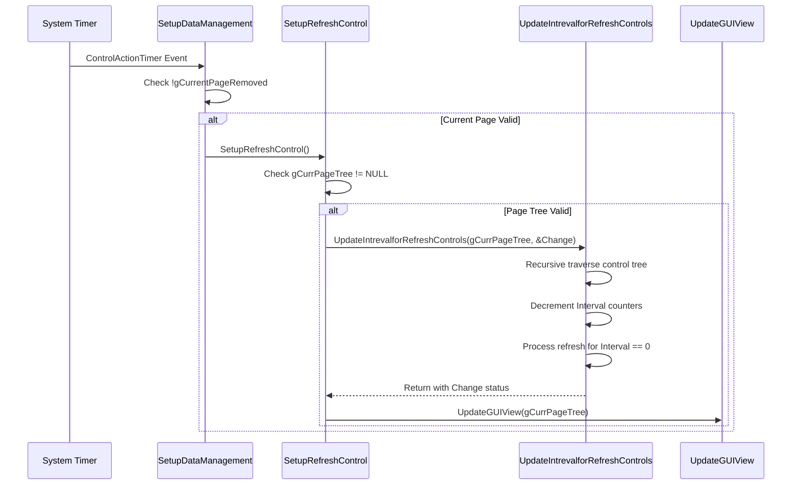

**参数传递和返回值处理：**

1. **输入参数**：

   * `TreeNode`：当前页面树根节点 (`gCurrPageTree`)

   * `Change`：布尔指针，用于返回是否有控件被刷新

2. **返回值处理**：

   * 函数本身无返回值（void）

   * 通过 `Change` 参数返回刷新状态

   * `Change` 为 TRUE 时表示至少有一个控件被刷新

#### 2.4.4 实际调用代码示例

**1. SetupRefreshControl 函数的完整实现**

```cpp
void SetupRefreshControl(void)
{
    // 安全检查：确保页面树存在
    if (NULL != gCurrPageTree) 
    {
        BOOLEAN Change = FALSE;  // 初始化刷新状态标志
        
        // 核心调用：遍历并处理所有控件的刷新
        UpdateIntrevalforRefreshControls(gCurrPageTree, &Change);
        
        // 更新GUI视图：无论是否有控件刷新都执行
        UpdateGUIView(gCurrPageTree);
    }
    // 如果 gCurrPageTree 为 NULL，则静默跳过刷新
}
```

**2. ControlActionTimer 事件处理中的调用**

```cpp
// 在 ProcessAction 函数中的事件处理
EFI_STATUS ProcessAction(void *ControlHandle, UINT32 Action, void *Value)
{
    EFI_STATUS Status = EFI_SUCCESS;
    
    switch(Action) 
    {
        // ... 其他 case 处理
        
        case ControlActionTimer:
            // 关键检查：确保当前页面未被移除
            if(!gCurrentPageRemoved)
            {
                // 调用刷新控制函数
                SetupRefreshControl();
            }
            // 注意：这里没有 break，可能继续执行后续代码
            break;
            
        // ... 其他 case 处理
    }
    
    return Status;
}
```

**3. 相关的条件判断和错误处理**

```cpp
// 在 UpdateIntrevalforRefreshControls 内部的错误处理
void UpdateIntrevalforRefreshControls(GUI_CTRL_INFO_NODE *TreeNode, BOOLEAN *Change)
{
    GUI_CTRL_INFO_NODE *CtrlNode = TreeNode;
    
    // 空指针检查
    if (((CONTROL_HANDLE *)(CtrlNode->CtrlHandle)))
    {
        // 间隔检查
        if (((CONTROL_HANDLE *)(CtrlNode->CtrlHandle))->Interval)
        {
            // 递减并检查是否归零
            if (--(((CONTROL_HANDLE *)(CtrlNode->CtrlHandle))->Interval) == 0)
            {
                EFI_STATUS Status = EFI_UNSUPPORTED;  // 默认状态
                
                // 控件句柄有效性检查
                if (((CONTROL_HANDLE *)(CtrlNode->CtrlHandle))->CtrlHandle)
                {
                    // ... 刷新处理逻辑
                    
                    // NVRAM 刷新操作
                    Status = UefiRefershQuestionValueNvRAM(
                        ((CONTROL_INFO *)(((CONTROL_HANDLE *)(CtrlNode->CtrlHandle))->CtrlHandle)));
                    
                    // 成功时更新状态
                    if (!EFI_ERROR(Status))
                    {
                        *Change = TRUE;  // 标记有变化
                        
                        // 更新父节点（如果存在）
                        if (CtrlNode->Parent)
                        {
                            UpdateControlSet(CtrlNode->Parent, FALSE);
                        }
                    }
                    // 失败时静默处理，不影响其他控件的刷新
                }
            }
        }
    }
    
    // 递归处理子节点和兄弟节点
    CtrlNode = CtrlNode->Child;
    while (CtrlNode)
    {
        UpdateIntrevalforRefreshControls(CtrlNode, Change);
        CtrlNode = CtrlNode->Next;
    }
}
```

#### 2.4.5 调用频率和性能考虑

**1. 定时器触发的调用频率**

```cpp
// 典型的调用频率设置（伪代码）
#define REFRESH_TIMER_INTERVAL  100  // 100ms 间隔
#define REFRESH_CYCLES_PER_SEC  10   // 每秒10次刷新

// 实际的刷新频率取决于：
// - 系统定时器的设置间隔
// - ControlRefresh 标志的值
// - 控件类型的计算因子（/5, /10, 或直接使用）
```

**2. 对系统性能的影响**

**性能影响分析：**

* **CPU 使用率**：

  * 每次调用需要遍历整个控件树

  * 递归调用的深度取决于页面复杂度

  * 大量控件时可能产生显著的 CPU 开销

* **内存访问**：

  * 频繁访问控件句柄和控制信息

  * NVRAM 读取操作相对耗时

  * 控件状态更新涉及内存写操作

* **I/O 操作**：

  * `UefiRefershQuestionValueNvRAM` 涉及 NVRAM 访问

  * GUI 更新可能触发显示设备操作

**3. 优化策略和建议**

```cpp
// 优化策略示例

// 1. 条件刷新：只刷新需要的控件
if (controlInfo->ControlFlags.ControlRefresh && 
    (controlInfo->ControlType == CONTROL_TYPE_DATE || 
     controlInfo->ControlType == CONTROL_TYPE_TIME))
{
    // 只对时间相关控件进行高频刷新
}

// 2. 批量更新：减少单独的 GUI 更新调用
BOOLEAN GlobalChange = FALSE;
UpdateIntrevalforRefreshControls(gCurrPageTree, &GlobalChange);
if (GlobalChange) {
    UpdateGUIView(gCurrPageTree);  // 只在有变化时更新
}

// 3. 智能间隔：根据控件重要性调整刷新频率
switch(controlInfo->ControlType) {
    case CONTROL_TYPE_DATE:
    case CONTROL_TYPE_TIME:
        // 高频刷新：每秒更新
        interval = ControlRefresh / 10;
        break;
    case CONTROL_TYPE_ACTION:
        // 中频刷新：按需更新
        interval = ControlRefresh;
        break;
    default:
        // 低频刷新：减少不必要的更新
        interval = ControlRefresh * 2;
        break;
}
```

**性能优化建议：**

1. **减少不必要的刷新**：只对真正需要实时更新的控件设置 `ControlRefresh` 标志
2. **调整刷新间隔**：根据控件的重要性和更新频率需求合理设置间隔值
3. **批量处理**：将多个控件的更新操作合并，减少 GUI 刷新次数
4. **条件更新**：只在控件值真正发生变化时才执行 GUI 更新
5. **缓存机制**：对频繁访问的 NVRAM 数据进行适当缓存

## 3. Interval 计算逻辑

### 3.1 不同控件类型的 Interval 计算规则

刷新机制根据控件类型采用不同的计算策略：

#### 3.1.1 DATE/TIME 控件

```cpp
if ((controlInfo->ControlType == CONTROL_TYPE_DATE) || (controlInfo->ControlType == CONTROL_TYPE_TIME))
{
    CtrlHandleValue->Interval = (UINT8)(controlInfo->ControlFlags.ControlRefresh) / 5;
}
```

* **计算公式**：`Interval = ControlRefresh / 5`

* **刷新频率**：相对较高，适合需要频繁更新的时间显示

* **应用场景**：系统时间、日期显示等实时性要求高的控件

#### 3.1.2 ACTION 控件

```cpp
else if (controlInfo->ControlType == CONTROL_TYPE_ACTION)
{
    CtrlHandleValue->Interval = controlInfo->ControlFlags.ControlRefresh;
}
```

* **计算公式**：`Interval = ControlRefresh`（直接使用）

* **刷新频率**：根据具体需求设定

* **应用场景**：按钮、操作触发器等交互控件

#### 3.1.3 其他控件

```cpp
else
    CtrlHandleValue->Interval = (UINT8)(controlInfo->ControlFlags.ControlRefresh) / 10;
```

* **计算公式**：`Interval = ControlRefresh / 10`

* **刷新频率**：相对较低，适合一般配置项

* **应用场景**：普通的配置选项、状态显示等

### 3.2 Interval 递减和归零触发机制

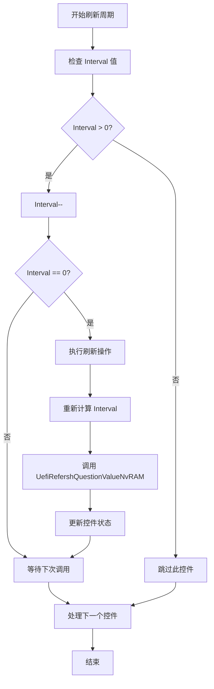

## 4. ControlRefresh 标志处理

### 4.1 ControlRefresh 标志的含义

`ControlRefresh` 是 `CONTROL_FLAGS` 结构中的一个字段：

```cpp
typedef struct {
    // ... 其他标志
    UINT8 ControlRefresh : 8;  // 刷新间隔基数
    // ... 其他标志
} CONTROL_FLAGS;
```

* **数值范围**：0-255

* **单位**：刷新周期的基数

* **含义**：值越小刷新越频繁，0 表示不刷新

### 4.2 在 CreateSetupTreeNode 中的设置过程

```cpp
// 在 CreateSetupTreeNode 函数中
if (controlInfo->ControlFlags.ControlRefresh)
{
    if ((controlInfo->ControlType == CONTROL_TYPE_DATE) || (controlInfo->ControlType == CONTROL_TYPE_TIME))
    {
        CtrlHandleValue->Interval = (UINT8)(controlInfo->ControlFlags.ControlRefresh) / 5;
    }
    else if (controlInfo->ControlType == CONTROL_TYPE_ACTION)
    {
        CtrlHandleValue->Interval = controlInfo->ControlFlags.ControlRefresh;
    }
    else
        CtrlHandleValue->Interval = (UINT8)(controlInfo->ControlFlags.ControlRefresh) / 10;
}
```

### 4.3 刷新频率控制机制

刷新频率的控制策略：

1. **基础频率**：由 `ControlRefresh` 字段设定基础刷新间隔
2. **类型调整**：根据控件类型应用不同的除数
3. **动态调整**：运行时可以根据系统状态动态调整刷新频率

## 5. 刷新执行流程

### 5.1 完整刷新流程图

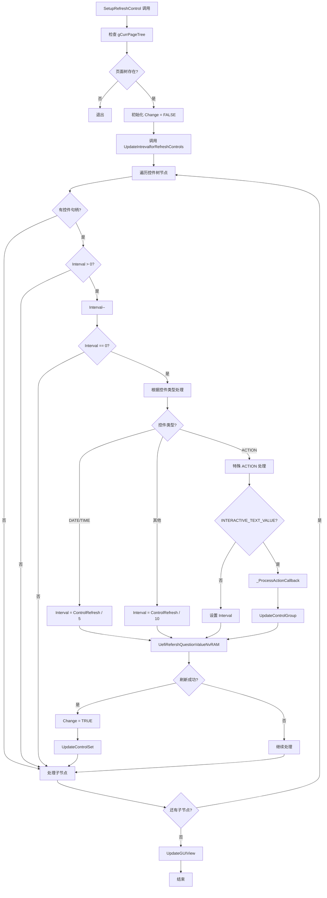

### 5.2 Interval 递减过程

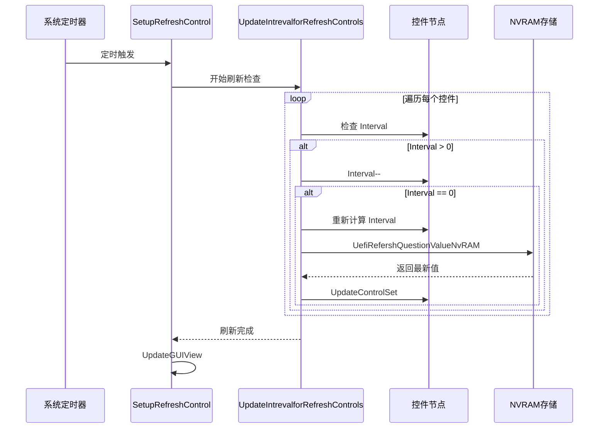

### 5.3 归零时的刷新操作

当 `Interval` 归零时执行的操作序列：

1. **重新计算间隔**：根据控件类型重新设置 `Interval` 值
2. **数据刷新**：调用 `UefiRefershQuestionValueNvRAM` 获取最新数据
3. **状态更新**：通过 `UpdateControlSet` 更新控件状态
4. **标记变化**：设置 `Change` 标志表示发生了更新

### 5.4 UefiRefershQuestionValueNvRAM 调用

```cpp
// 函数声明（在 SetupPageTree.cpp 中）
extern EFI_STATUS UefiRefershQuestionValueNvRAM(CONTROL_INFO *ControlData);

// 调用位置
Status = UefiRefershQuestionValueNvRAM(((CONTROL_INFO *)(((CONTROL_HANDLE *)(CtrlNode->CtrlHandle))->CtrlHandle)));
```

**功能说明：**

* **数据同步**：从 NVRAM 中读取控件对应的最新值

* **缓存更新**：更新内存中的缓存数据

* **状态返回**：返回操作状态，成功时触发后续更新

### 5.5 UpdateControlSet 更新机制

```cpp
if (!EFI_ERROR(Status))
{
    *Change = TRUE;
    if (CtrlNode->Parent) // on refresh, update the state and value of all nodes.
    {
        UpdateControlSet(CtrlNode->Parent, FALSE);
    }
}
```

**更新策略：**

* **向上更新**：从当前节点的父节点开始更新

* **级联更新**：更新父节点及其所有子节点

* **状态同步**：确保整个控件集合的状态一致性

## 6. 特殊控件处理

### 6.1 ACTION 控件的特殊处理逻辑

ACTION 控件具有特殊的刷新处理机制：

```cpp
else if (((CONTROL_INFO *)(((CONTROL_HANDLE *)(CtrlNode->CtrlHandle))->CtrlHandle))->ControlType == CONTROL_TYPE_ACTION)
{
    Value = UefiTseLiteGetAmiCallbackIndex(
        ((CONTROL_INFO *)(((CONTROL_HANDLE *)(CtrlNode->CtrlHandle))->CtrlHandle))->ControlConditionalPtr, 
        ((CONTROL_INFO *)(((CONTROL_HANDLE *)(CtrlNode->CtrlHandle))->CtrlHandle))->ControlPtr);
    
    if (Value == INTERACTIVE_TEXT_VALUE)
    {
        _ProcessActionCallback(((CONTROL_INFO *)((CONTROL_HANDLE *)(CtrlNode->CtrlHandle))->CtrlHandle), TRUE);
        (((CONTROL_HANDLE *)(CtrlNode->CtrlHandle))->Interval) = 
            (((CONTROL_INFO *)(((CONTROL_HANDLE *)(CtrlNode->CtrlHandle))->CtrlHandle))->ControlFlags.ControlRefresh);
        *Change = UpdateControlGroup(gCurrentPage->Child, TRUE);
    }
}
```

### 6.2 INTERACTIVE\_TEXT\_VALUE 判断

* **条件检查**：通过 `UefiTseLiteGetAmiCallbackIndex` 获取回调索引

* **交互判断**：检查是否为 `INTERACTIVE_TEXT_VALUE` 类型

* **特殊处理**：满足条件时执行特殊的回调处理

#### 6.2.1 `UefiTseLiteGetAmiCallbackIndex` 函数详细分析

**函数原型**：
```cpp
UINT16 UefiTseLiteGetAmiCallbackIndex(VOID *Ptr, VOID *CtrlPtr)
```

**参数分析**：
- **`Ptr`** (`ControlConditionalPtr`): 指向控件条件指针，通常指向 `EFI_IFR_SUPPRESS_IF_OP` 操作码
- **`CtrlPtr`** (`ControlPtr`): 指向控件本身的 IFR 操作码指针，用作搜索边界

**函数功能**：
1. **条件检查**: 验证 `Ptr` 是否指向 `EFI_IFR_SUPPRESS_IF_OP` 操作码
2. **作用域遍历**: 在 SUPPRESS_IF 作用域内搜索 `EFI_IFR_EQ_ID_VAL_OP` 操作码
3. **值提取**: 从 `EFI_IFR_EQ_ID_VAL` 结构中提取 `Value` 字段
4. **返回值**: 返回提取的值，如果未找到则返回 `0xFFFF`

**核心实现逻辑**：
```cpp
// Function implementation from uefi21wapper.c:1376
UINT16 UefiTseLiteGetAmiCallbackIndex(VOID * Ptr, VOID * CtrlPtr)
{
    EFI_IFR_OP_HEADER * OpHeader = (EFI_IFR_OP_HEADER *)Ptr;
    UINT16 Index = 0xFFFF;  // Default return value
    UINT8 InScope = 0;      // Scope depth counter
    VOID *SupressIfPtr = NULL;

    // Verify the pointer points to SUPPRESS_IF opcode
    if ((OpHeader != NULL) && (OpHeader->OpCode == EFI_IFR_SUPPRESS_IF_OP))
    {
        // Locate the last suppress_if till the control pointer
        do {
            if(OpHeader->Scope) InScope++;
            if(OpHeader->OpCode == EFI_IFR_END_OP) {
                InScope--;
                if(InScope == 0) goto DONE;  // EFI_IFR_EQ_ID_VAL_OP not found
            }
            if(OpHeader->OpCode == EFI_IFR_SUPPRESS_IF_OP)
                SupressIfPtr = (VOID*)OpHeader;
            OpHeader = (EFI_IFR_OP_HEADER*)((UINT8*)OpHeader + OpHeader->Length);
        } while((UINTN)OpHeader < (UINTN)CtrlPtr);

        // Search for EFI_IFR_EQ_ID_VAL_OP within the suppress_if scope
        OpHeader = (EFI_IFR_OP_HEADER*)SupressIfPtr;
        do {
            if(OpHeader->Scope) InScope++;
            if(OpHeader->OpCode == EFI_IFR_END_OP) {
                InScope--;
                if(InScope == 0) goto DONE;  // Not found
            }
            OpHeader = (EFI_IFR_OP_HEADER*)((UINT8*)OpHeader + OpHeader->Length);
        } while(OpHeader->OpCode != EFI_IFR_EQ_ID_VAL_OP);

        // Extract the value from EFI_IFR_EQ_ID_VAL structure
        if(OpHeader->OpCode == EFI_IFR_EQ_ID_VAL_OP) {
            Index = ((EFI_IFR_EQ_ID_VAL*)OpHeader)->Value;
        }
    }

DONE:
    return Index;
}
```

**返回值 `INTERACTIVE_TEXT_VALUE` 的含义**：
- **常量定义**: `#define INTERACTIVE_TEXT_VALUE 11` (AMIVfr.h:375)
- **特殊标识**: 表示该 ACTION 控件是交互式文本类型
- **触发条件**: 当控件的条件表达式匹配到此值时，需要执行特殊的回调处理

**在刷新机制中的作用**：
- **控件分类**: 区分普通 ACTION 控件和交互式文本控件
- **处理分支**: 决定是否调用 `_ProcessActionCallback` 函数
- **刷新策略**: 交互式文本控件需要更频繁的刷新和特殊处理

### 6.3 \_ProcessActionCallback 回调处理

当检测到 `INTERACTIVE_TEXT_VALUE` 时，会调用 `_ProcessActionCallback` 函数：

```cpp
_ProcessActionCallback(((CONTROL_INFO *)((CONTROL_HANDLE *)(CtrlNode->CtrlHandle))->CtrlHandle), TRUE);
```

#### 6.3.1 `_ProcessActionCallback` 函数详细分析

**函数原型**：
```cpp
EFI_STATUS _ProcessActionCallback(CONTROL_INFO *ControlData, BOOLEAN InteractiveText)
```

**参数分析**：
- **`ControlData`**: 指向 `CONTROL_INFO` 结构的指针，包含控件的完整信息
  - `ControlHandle`: HII 句柄
  - `QuestionId`: 问题 ID
  - `ControlType`: 控件类型
  - `ControlFlags`: 控件标志位
  - `ControlPtr`: 指向 IFR 操作码的指针
- **`InteractiveText`**: 布尔值，指示处理模式
  - `TRUE`: 交互式文本模式，调用特殊回调
  - `FALSE`: 标准模式，调用标准表单回调

**核心实现逻辑**：
```cpp
// Function implementation from SetupDataManagement.cpp:3841
EFI_STATUS _ProcessActionCallback(CONTROL_INFO *ControlData, BOOLEAN InteractiveText)
{
    EFI_STATUS Status = EFI_SUCCESS;

    // Check if the control is interactive
    if(UefiIsInteractive(ControlData))
    {
        if(InteractiveText)
        {
            // Special callback for interactive text controls
            Status = SpecialActionCallBack(ControlData, UefiGetControlKey(ControlData));
        }
        else
        {
            // Standard form callback processing
            UefiPreControlUpdate(NULL);
            Status = CallFormCallBack(ControlData, UefiGetControlKey(ControlData), 
                                    FALSE, AMI_CALLBACK_CONTROL_UPDATE);
            
            // Set global update flags
            gbUpdatePagesRequired = TRUE;
            
            // Check if reset is required
            if (ControlData->ControlFlags.ControlReset) 
                gResetRequired = TRUE;
        }
    }

    return Status;
}
```

#### 6.3.2 函数执行流程详解

1. **交互性验证**:
   - 调用 `UefiIsInteractive(ControlData)` 检查控件是否支持交互
   - 只有交互式控件才会执行回调处理

2. **处理模式分支**:
   - **交互式文本模式** (`InteractiveText = TRUE`):
     - 调用 `SpecialActionCallBack()` 函数
     - 用于处理特殊的交互式文本控件
     - 通常用于动态文本更新、状态显示等
   
   - **标准模式** (`InteractiveText = FALSE`):
     - 调用 `UefiPreControlUpdate()` 进行预处理
     - 调用 `CallFormCallBack()` 执行标准表单回调
     - 设置全局更新标志 `gbUpdatePagesRequired = TRUE`
     - 检查并设置重置标志 `gResetRequired`

3. **状态管理**:
   - **页面更新**: 标记页面需要重新渲染
   - **重置检查**: 根据控件标志决定是否需要系统重置
   - **返回状态**: 返回回调执行的结果状态

#### 6.3.3 在刷新流程中的作用

- **触发时机**: 仅在检测到 `INTERACTIVE_TEXT_VALUE` 时调用
- **处理频率**: 根据控件的 `ControlRefresh` 标志设置刷新间隔
- **协作关系**: 与 `UpdateControlGroup()` 协同工作更新控件组
- **数据同步**: 确保 UI 显示与底层数据保持同步

### 6.4 UpdateControlGroup 更新

```cpp
*Change = UpdateControlGroup(gCurrentPage->Child, TRUE);
```

* **范围更新**：更新当前页面的整个控件组

* **强制更新**：第二个参数为 `TRUE` 表示强制更新

* **返回状态**：返回是否发生了实际更新

## 7. SIO 风扇数据刷新流程分析

### 7.1 SIO 硬件监控架构概述

SIO (Super I/O) 芯片 NCT5585D 负责监控系统的硬件状态，包括风扇转速、温度、电压等。在 BIOS 中，通过专门的 HWM (Hardware Monitor) 模块来读取和显示这些数据。

**架构组成**：
- **硬件层**: NCT5585D SIO 芯片，包含多个 Bank 寄存器
- **驱动层**: HWM 驱动程序，提供 I/O 接口访问
- **数据层**: HWM_DATA 结构，存储监控数据
- **显示层**: HII 界面控件，显示实时数据

### 7.2 风扇数据获取流程详解

#### 7.2.1 GetAndUpdateFan1Speed 函数深度分析

```cpp
/**
  Get the first FAN speed value in HWM space register and update to HII.
  
  @param  Data         Pointer to HWM_DATA structure for HII display
**/
void GetAndUpdateFan1Speed(IN OUT HWM_DATA * Data)
{
    UINTN Speed;    // Temporary variable for register value
    UINTN Count;    // Combined fan count value

    // Initialize HII display parameters
    Data->Token = STRING_TOKEN(STR_HWM1_FAN1_SPEED_VALUE);  // String token for display
    Data->Type = FAN_SPEED;                                 // Data type identifier
    Data->OddPos = 0x00;                                   // Position flag

    // Read fan tachometer count from SIO registers
    // NCT5585D Bank4 Register 0xB0: Fan1 Count High Byte (bits 12-5)
    GetValueWithIO(0x04, 0xB0, &Speed);
    Count = (UINT8)Speed << 5;                             // Shift to high bits
    
    // NCT5585D Bank4 Register 0xB1: Fan1 Count Low Byte (bits 4-0)
    GetValueWithIO(0x04, 0xB1, &Speed);
    Speed &= 0x1F;                                         // Mask low 5 bits
    Count |= Speed;                                        // Combine to 13-bit count

    // Validate count and calculate RPM
    // Invalid count conditions: 0xFFFF, 0x0FFF, 0, 0x1FFF
    if((Count == 0xFFFF) || (Count == 0x0FFF) || (Count == 0) || (Count == 0x1FFF)) {
        Speed = 0;                                         // Set to 0 for invalid readings
    } else {
        // RPM calculation formula: RPM = 1350000 / Count
        // Based on NCT5585D datasheet: Clock frequency / (Count * Divisor)
        Speed = (UINTN)1350000 / Count;
    }
    
    // Store calculated speed in HII data structure
    Data->Value = (UINT16)Speed;
    
    return;
}
```

#### 7.2.2 寄存器访问机制

**NCT5585D 寄存器映射**：
```
Bank 4 (Hardware Monitor):
├── 0xB0: Fan1 Count Register (High Byte) - bits [12:5]
├── 0xB1: Fan1 Count Register (Low Byte)  - bits [4:0]
├── 0xB2: Fan2 Count Register (High Byte) - bits [12:5]
├── 0xB3: Fan2 Count Register (Low Byte)  - bits [4:0]
└── ...
```

**GetValueWithIO 函数调用流程**：
1. **Bank 选择**: 设置 SIO 芯片的 Bank 为 0x04 (HWM Bank)
2. **寄存器访问**: 读取指定偏移地址的寄存器值
3. **数据返回**: 返回 8 位寄存器数据

#### 7.2.3 风扇转速计算公式

**计算原理**：
```
RPM = Clock_Frequency / (Count * Divisor)
    = 1350000 / Count

其中：
- Clock_Frequency: SIO 芯片内部时钟频率
- Count: 13 位风扇计数值 (0xB0[7:0] << 5 | 0xB1[4:0])
- Divisor: 分频系数 (已包含在常数中)
```

**异常值处理**：
- `0xFFFF`: 寄存器读取错误
- `0x0FFF`: 计数器溢出
- `0x0000`: 风扇停转或未连接
- `0x1FFF`: 计数器最大值 (K220112+ 新增)

### 7.3 UI 显示配置详解

#### 7.3.1 Setup Definition (SD) 文件集成

`Nct5585dHwmSetup.sd` 文件是 Setup Definition 的缩写，包含了风扇显示的 HII 表单定义。该文件通过 ELINK 机制集成到 BIOS Setup 系统中：

**ELINK 集成机制**：
1. **根 ELINK 定义**: 在 `AmiCompatibilityPkg.sdl` 中定义 `SETUP_DEFINITIONS` ELINK
2. **模块注册**: NCT5585D 模块通过 ELINK 将 SD 文件添加到 `SETUP_DEFINITIONS` 中
3. **构建处理**: Makefile 处理这些 ELINK，生成 `Build/Setup.inf` 和 `Build/SetupDefinitions.h`

**SD 文件内容结构**：
```cpp
// Fan1 Speed Display Control - Interactive text control for real-time updates
#define HWM1_TEXT_FAN1_SPEED \
        INTERACTIVE_TEXT(STRING_TOKEN(STR_EMPTY), \
                        STRING_TOKEN(STR_HWM1_FAN1_SPEED), \
                        STRING_TOKEN(STR_HWM1_FAN1_SPEED_VALUE), \
                        AUTO_ID(NCT5585D_INTERACTIVE_KEY))

// Fan3 Speed Display Control - Static text control for display
#define SIO_HWM1_TEXT_FAN3_SPEED \
  text\
  help   = STRING_TOKEN(STR_EMPTY),\
  text   = STRING_TOKEN(STR_SIO_HWM1_FAN3_SPEED),\
  text   = STRING_TOKEN(STR_SIO_HWM1_FAN3_SPEED_VALUE),\
  flags  = 0,\
  key    = 0;
```

**构建系统集成流程**：
```
AmiCompatibilityPkg.sdl (SETUP_DEFINITIONS ELINK)
    ↓
各模块 .sdl 文件 (通过 ELINK 添加 SD 文件)
    ↓
Makefile 处理 (AmiCompatibilityPkg.mak + Setup.mak)
    ↓
生成 Build/Setup.inf (包含所有 SD 文件)
    ↓
生成 Build/SetupDefinitions.h (包含所有 #include 指令)
```

#### 7.3.2 字符串资源配置

`Nct5585dHwmSetup.uni` 文件包含多语言字符串资源，同样通过 ELINK 机制集成到构建系统中：

```
// English strings - Default language for HWM display
#string STR_HWM1_FAN1_SPEED             #language eng "CPU Fan Speed"
#string STR_HWM1_FAN1_SPEED_VALUE       #language eng "N/A"
#string STR_SIO_HWM1_FAN3_SPEED_VALUE   #language eng "N/A"

// Chinese strings - Localized display for Chinese users
#string STR_SIO_HWM1_FAN3_SPEED_VALUE   #language zh-chs "不可用"
```

**SD 文件的完整组成**：
- **HII 表单定义**: 定义 Setup 页面的布局和控件
- **控件宏定义**: 如 `HWM1_TEXT_FAN1_SPEED` 等交互式文本控件
- **字符串引用**: 通过 `STRING_TOKEN` 引用 .uni 文件中的字符串
- **回调关联**: 通过 `AUTO_ID` 和 `NCT5585D_INTERACTIVE_KEY` 关联回调函数

**构建时整合过程**：
1. **收集阶段**: ELINK 机制收集所有模块的 SD 文件路径
2. **生成阶段**: Makefile 将 SD 文件路径写入 `Build/Setup.inf` 的 [Sources] 段
3. **包含阶段**: 生成 `Build/SetupDefinitions.h` 包含所有 SD 文件的 #include 指令
4. **编译阶段**: Setup 模块编译时包含所有 SD 文件定义，形成完整的 HII 资源

### 7.4 回调机制集成

#### 7.4.1 Nct5585dHwmCallBack 函数

```cpp
/**
  HWM Form CallBack Function for NCT5585D
  
  @param  This                 Points to the EFI_HII_CONFIG_ACCESS_PROTOCOL
  @param  Action               Specifies the type of action taken by the browser
  @param  QuestionId           A unique value which is sent to the original exporting driver
  @param  Type                 The type of value for the question
  @param  Value                A pointer to the data being sent to the original exporting driver
  @param  ActionRequest        On return, points to the action requested by the callback function
  
  @retval EFI_SUCCESS          The callback successfully handled the action
**/
EFI_STATUS Nct5585dHwmCallBack(
    IN CONST EFI_HII_CONFIG_ACCESS_PROTOCOL *This,
    IN EFI_BROWSER_ACTION Action,
    IN EFI_QUESTION_ID QuestionId,
    IN UINT8 Type,
    IN EFI_IFR_TYPE_VALUE *Value,
    OUT EFI_BROWSER_ACTION_REQUEST *ActionRequest
)
{
    EFI_STATUS Status = EFI_SUCCESS;
    UINTN i;

    // Process callback only for changing action
    if(Action == EFI_BROWSER_ACTION_CHANGING) {
        // Update all HWM data by calling external functions
        for(i = 0; Nct5585dExternalFunList[i] != NULL; i++) {
            Nct5585dExternalFunList[i](&HwmData[i]);
        }
        
        // Update HII database with new values
        HHMCommon(HwmData, 
                 sizeof(HwmData)/sizeof(HWM_DATA), 
                 This, 
                 gHiiHandle);
    }

    return Status;
}
```

#### 7.4.2 外部函数列表

```cpp
// External function list for HWM data update
HWM_CALLBACK_FUNCTION Nct5585dExternalFunList[] = {
    GetAndUpdateFan1Speed,      // Fan1 speed update function
    GetAndUpdateFan2Speed,      // Fan2 speed update function  
    GetAndUpdateFan3Speed,      // Fan3 speed update function
    GetAndUpdateCpuCoreVoltage, // CPU voltage update function
    GetAndUpdateVhifVoltage,    // VHIF voltage update function
    // ... other monitoring functions
    NULL                        // List terminator
};
```

### 7.5 完整数据刷新流程

#### 7.5.1 刷新触发机制

1. **定时触发**: `SetupRefreshControl` 定时器 (通常 1 秒间隔)
2. **控件遍历**: `UpdateIntrevalforRefreshControls` 遍历页面控件树
3. **类型检查**: 识别 `CONTROL_TYPE_ACTION` 类型控件
4. **回调检测**: 调用 `UefiTseLiteGetAmiCallbackIndex` 检查回调值
5. **条件判断**: 比较返回值与 `INTERACTIVE_TEXT_VALUE` (11)

#### 7.5.2 数据更新执行

1. **回调调用**: `_ProcessActionCallback` 执行特殊回调
2. **函数遍历**: `Nct5585dHwmCallBack` 遍历外部函数列表
3. **硬件读取**: `GetAndUpdateFan1Speed` 读取 SIO 寄存器
4. **数据计算**: 执行转速计算和异常处理
5. **结构更新**: 更新 `HWM_DATA` 结构中的值

#### 7.5.3 UI 界面刷新

1. **HII 更新**: `HHMCommon` 函数更新 HII 数据库
2. **控件刷新**: 标记相关控件需要重绘
3. **页面渲染**: Skia 图形引擎重新渲染显示内容
4. **用户可见**: 用户看到更新后的风扇转速数值

### 7.6 SIO 风扇数据刷新流程活动图

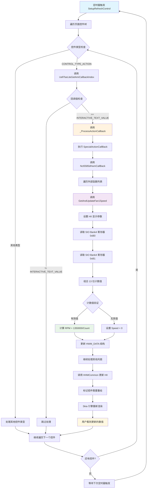

### 7.7 详细数据流转过程

#### 7.7.1 硬件到软件的数据流

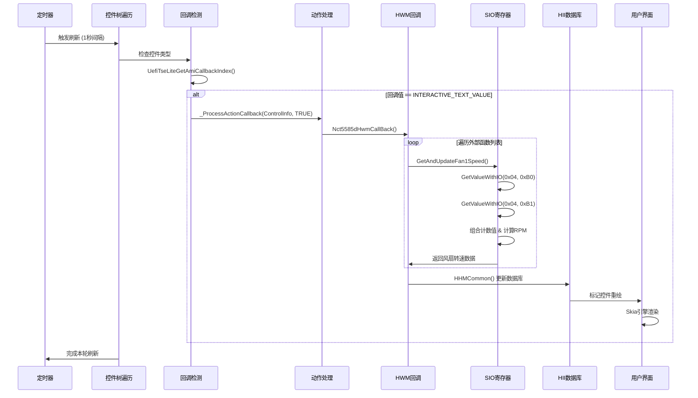

#### 7.7.2 寄存器读取时序

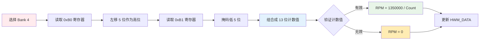

### 7.8 性能优化考虑

#### 7.8.1 刷新频率控制

- **间隔设置**: 通过 `ControlRefresh` 标志控制刷新间隔
- **按需更新**: 只有可见的 HWM 控件才会触发数据更新
- **批量处理**: 一次回调更新所有 HWM 数据，减少 I/O 操作

#### 7.8.2 错误处理机制

- **寄存器验证**: 检查读取的寄存器值是否有效
- **计算保护**: 避免除零错误和溢出
- **显示容错**: 无效数据显示为 "N/A" 或 "不可用"

#### 7.8.3 I/O 优化策略

- **寄存器缓存**: 避免重复读取相同寄存器
- **批量读取**: 一次性读取多个相关寄存器
- **异常恢复**: SIO 访问失败时的恢复机制

## 8. 递归遍历机制

### 8.1 树形结构的递归遍历

```cpp
// 递归处理子节点
CtrlNode = CtrlNode->Child;
while (CtrlNode)
{
    UpdateIntrevalforRefreshControls(CtrlNode, Change);
    CtrlNode = CtrlNode->Next;
}
```

### 8.2 遍历策略

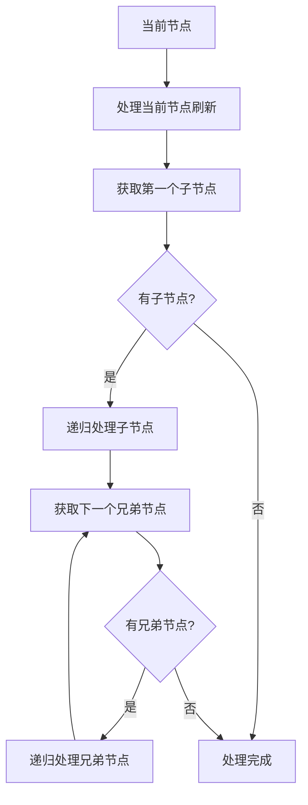

### 8.3 子节点和兄弟节点的处理

* **深度优先**：先处理子节点，再处理兄弟节点

* **完整遍历**：确保树中每个节点都被访问

* **状态传递**：`Change` 参数在递归过程中传递更新状态

### 8.4 全局刷新控制

刷新机制的全局控制策略：

1. **页面级控制**：以页面为单位进行刷新管理
2. **节点级控制**：每个节点独立管理自己的刷新间隔
3. **级联更新**：父节点更新时影响所有子节点
4. **状态同步**：确保整个页面的数据一致性

## 9. 刷新机制的实际应用

### 8.1 实时数据更新场景

1. **系统时间显示**

   * 控件类型：`CONTROL_TYPE_TIME`

   * 刷新频率：`ControlRefresh / 5`

   * 应用场景：BIOS 设置界面的时间显示

2. **系统日期显示**

   * 控件类型：`CONTROL_TYPE_DATE`

   * 刷新频率：`ControlRefresh / 5`

   * 应用场景：BIOS 设置界面的日期显示

3. **硬件状态监控**

   * 控件类型：普通控件

   * 刷新频率：`ControlRefresh / 10`

   * 应用场景：CPU 温度、风扇转速等状态显示

### 8.2 动态控件状态变化

1. **条件依赖控件**

   * 根据其他设置的变化自动启用/禁用

   * 通过刷新机制实时检查依赖条件

2. **动态选项列表**

   * 根据硬件配置动态生成选项

   * 通过刷新机制更新可用选项

### 8.3 用户交互响应

1. **交互式按钮**

   * 控件类型：`CONTROL_TYPE_ACTION`

   * 特殊处理：`INTERACTIVE_TEXT_VALUE` 检查

   * 应用场景：需要实时反馈的操作按钮

2. **状态指示器**

   * 实时显示操作结果或系统状态

   * 通过刷新机制保持状态同步

## 10. 性能考虑和优化

### 9.1 刷新频率的平衡

刷新频率设计需要在实时性和性能之间找到平衡：

1. **高频刷新控件**（DATE/TIME）

   * 优点：实时性好，用户体验佳

   * 缺点：CPU 占用较高

   * 优化：仅在必要时启用高频刷新

2. **中频刷新控件**（ACTION）

   * 优点：响应及时，资源消耗适中

   * 缺点：需要精确控制刷新时机

   * 优化：根据用户交互动态调整频率

3. **低频刷新控件**（普通控件）

   * 优点：资源消耗低

   * 缺点：实时性相对较差

   * 优化：批量更新，减少单次开销

### 9.2 资源消耗控制

1. **内存优化**

   * 避免频繁的内存分配和释放

   * 使用对象池管理控件实例

   * 及时清理不再需要的数据

2. **CPU 优化**

   * 避免不必要的刷新操作

   * 使用增量更新而非全量更新

   * 合理设置刷新间隔

3. **I/O 优化**

   * 批量读取 NVRAM 数据

   * 缓存频繁访问的数据

   * 避免重复的存储访问

### 9.3 刷新范围优化

1. **精确刷新**

   * 只刷新实际发生变化的控件

   * 避免不必要的级联更新

   * 使用脏标记机制

2. **批量刷新**

   * 将多个小的刷新操作合并

   * 减少刷新调用的次数

   * 提高整体效率

3. **条件刷新**

   * 根据系统状态决定是否刷新

   * 在系统空闲时进行刷新

   * 避免在关键操作期间刷新

## 11. 流程图和时序图

### 10.1 刷新机制的完整流程图

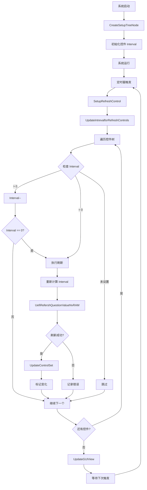

### 10.2 Interval 计算和处理的时序图

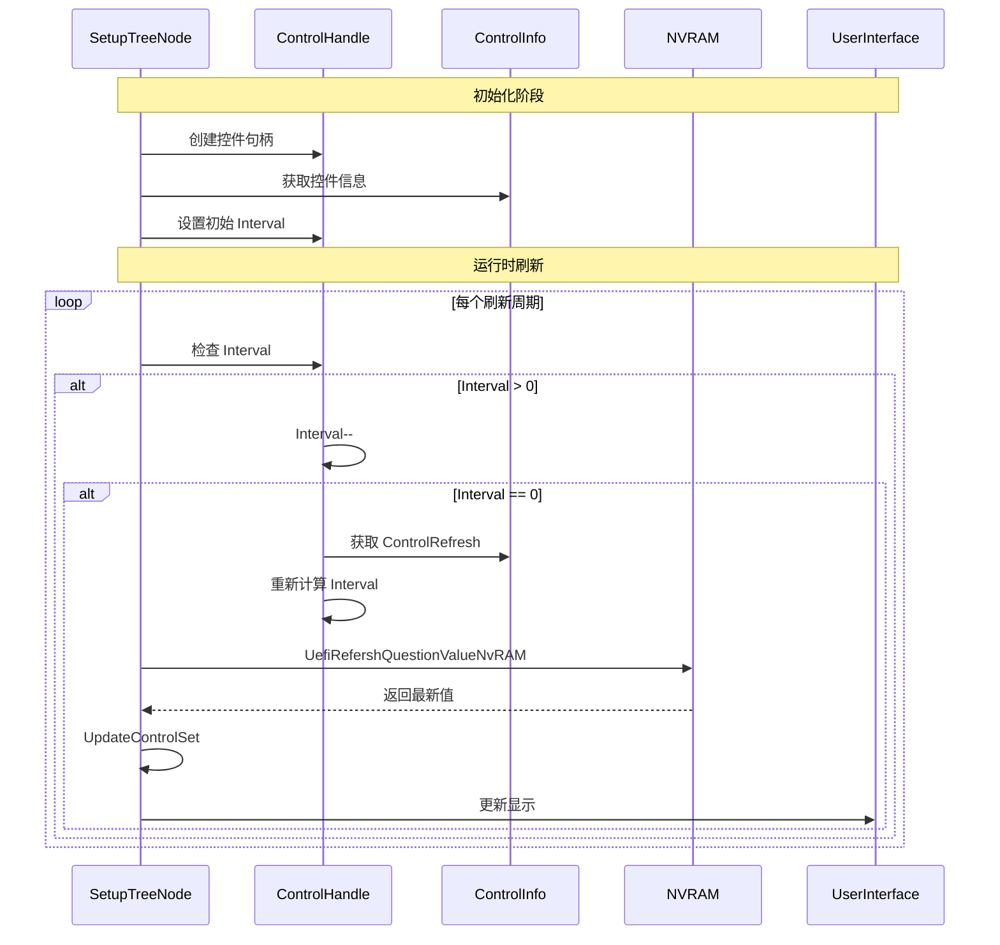

### 10.3 不同控件类型的刷新策略对比

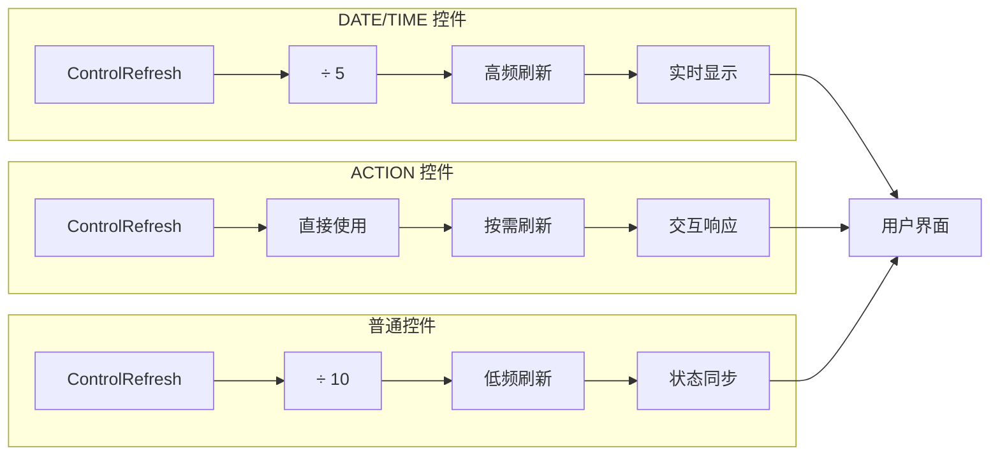

## 12. 总结

AmiTsePkg/SkiaPkg 的刷新机制是一个精心设计的系统，它通过以下关键特性确保了 BIOS Setup UI 的高效运行：

### 11.1 核心特性

1. **分层刷新策略**：根据控件类型采用不同的刷新频率
2. **递归遍历机制**：确保整个控件树的完整更新
3. **状态同步机制**：保证数据的一致性和准确性
4. **性能优化设计**：平衡实时性和资源消耗

### 11.2 技术优势

1. **灵活性**：支持不同类型控件的个性化刷新需求
2. **可扩展性**：易于添加新的控件类型和刷新策略
3. **稳定性**：通过错误处理和状态检查确保系统稳定
4. **效率性**：通过优化的算法和数据结构提高执行效率

### 11.3 应用价值

刷新机制在 BIOS Setup UI 中发挥着重要作用，为用户提供了：

* **实时的数据显示**：确保用户看到最新的系统状态

* **流畅的交互体验**：及时响应用户操作和系统变化

* **可靠的数据一致性**：防止配置错误和数据不同步

* **高效的资源利用**：在保证功能的前提下最小化资源消耗

这个刷新机制的设计体现了 AMI BIOS 在用户体验和系统性能方面的深度考虑，为构建高质量的 BIOS Setup UI 提供了坚实的技术基础。
