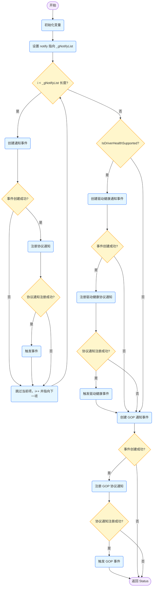

RegisterNotification是AMITse中核心函数
里面包含了绝大部分有关AMITse的callback，Event，Hook
`AmiTsePkg\EDK\MiniSetup\BootOnly\notify.c`
```C
/**
    It will create a notify event and register a notification.
    @param VOID
    @retval Status
**/
EFI_STATUS RegisterNotification( VOID )
{
	EFI_STATUS 	Status = EFI_UNSUPPORTED;
	UINTN 		i;
	EFI_EVENT 	Event, GopEvent;
	EFI_GUID 	EfiDriverHealthProtocolGuid = EFI_DRIVER_HEALTH_PROTOCOL_GUID;
	VOID 		*Registration = NULL, *GopRegistration = NULL;

	NOTIFICATION_INFO **notify = _gNotifyList;

	for ( i = 0; *notify != NULL; i++, notify++ )
	{
		Status = gBS->CreateEvent(
				EFI_EVENT_NOTIFY_SIGNAL,
				EFI_TPL_CALLBACK,
				NotificationFunction,
				*notify,
				&((*notify)->NotifyEvent)
				);

		if ( EFI_ERROR(Status) )
			continue;	

		Status = gBS->RegisterProtocolNotify(
				(*notify)->NotifyGuid,
				(*notify)->NotifyEvent,
				&((*notify)->NotifyRegistration)
				);
			// get any of these events that have occured in the past
		if (!EFI_ERROR (Status))
		{
		    gBS->SignalEvent( (*notify)->NotifyEvent );
		}
	}
	if (IsDriverHealthSupported ())			//Notifying the driver health protocol installation to update the drv health variable in cache
	{
		Status = gBS->CreateEvent(
				EFI_EVENT_NOTIFY_SIGNAL,
				EFI_TPL_CALLBACK,
				_DrvHealthNotifyFunction,
				NULL,
				&Event
				);
		if (!EFI_ERROR (Status))
		{
			Status = gBS->RegisterProtocolNotify(
				&EfiDriverHealthProtocolGuid,
				Event,
				&Registration
				);
			if (!EFI_ERROR(Status))
			{
				gBS->SignalEvent (Event);
			}
		}
	}

//Validate the Gop before usage in all the possible cases and also get instance of Gop through notification
	Status = gBS->CreateEvent(
				EFI_EVENT_NOTIFY_SIGNAL,
				EFI_TPL_CALLBACK,
				_UpdateGoPNotifyFunction,
				NULL,
				&GopEvent
				);
		if (!EFI_ERROR (Status))
		{
			Status = gBS->RegisterProtocolNotify(
				&gEfiGraphicsOutputProtocolGuid,
				GopEvent,
				&GopRegistration
				);
			if (!EFI_ERROR(Status))
			{
				gBS->SignalEvent (GopEvent);
			}
		}
	return Status;
}
```



RegisterNotification通过CreateEvent注册Event，当相应的Event被触发， 就会执行NotificationFunction中对应的动作

