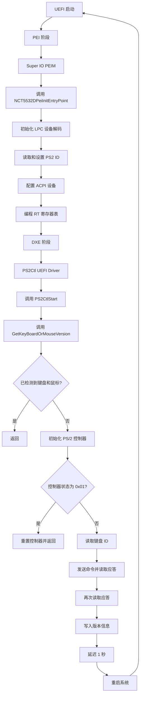

> 2024-11-29 10:09:53
> 
> 这几天遇到PS2键盘鼠标的问题：
> 
> PS2二合一的板子。就是说这个接口既可以插鼠标，也可以插键盘
> 
> **问题现象**：只识别鼠标，键盘无法识别，接键盘PSOT过程中键盘灯会亮灭三次，然后灭掉，进OS后没有响应，DM里面没有PS2键盘设备，PS2接口插PS2鼠标时有功能

# Debug
```C
/**
    Detects the presence of Keyboard and Mouse in KBC port.
    @param    None. Keyboard interface is disabled.

    @retval    Ps2KbdDetected and Ps2MouseDetected variable set according the device presence
    
**/
EFI_STATUS
DetectPS2KeyboardAndMouse ()
{
    UINT16      wCount;
    UINT8       bData;
    BOOLEAN     bAck = FALSE;

    if(Ps2KbdMouseDetected) {
        // Ps2Keyboard and Mouse Detected already
        return EFI_SUCCESS;
    }
    Ps2KbdMouseDetected=TRUE;
  
    // FALSE is passing as argument to intimate, according to DETECT_PS2_MOUSE value, perform Mouse Detection
    DetectPs2Mouse(FALSE);
    if ( DetectPs2KeyboardValue ) 
        // PROGRESS_CODE(DXE_KEYBOARD_DETECT);
        Write8042CommandByte (0x6d);
        KBCGetData();                                       // Dummy read
        for (wCount = 0; wCount < 3; wCount++) {
            // Disable Scanning
            if (!ReadDevice(KBD_DISABLE_SCANNING, &bData, KB_ACK_COM)) break;
            if (IoRead8(KBC_CMDSTS_PORT) & 0x40) {              // Time out error
                gBS->Stall(6000);           // 6 msec
                // After power-up some junk data comes from KBD. If not eaten
                // other command will fail.
                KBCGetData();
            }
        }
        DisableKeyboard();
        KBCGetData();  
        /**
        ** 这里就是键盘灯亮灭三次的地方
        ** 我在这里debug 函数ReadDevice(KBD_RESET, &bData, KB_ACK_COM)是否会返回ACK，
	    ** 结果是否定的，返回的是0xFE，换了个键盘也是这种情况
        */
        // 3 times retry on keyboard reset
        for (wCount = 0; wCount < 3; wCount++) {
            if (!ReadDevice(KBD_RESET, &bData, KB_ACK_COM)) {   // ACK received
                bAck = TRUE;
                break;
            } else {        
                KBCGetData();                       // Dummy read
            }
        }

        if (bAck) {                             //If not not Keyboard
            if (ObFullRead() == 0xAA) {     // Reset successful
                Ps2KbdDetected=TRUE;
            } else if (Read8042(0xAB)) {       // On Success returns 0
                // 0x01 if Clock line stuck low, 0x02 if clock line stuck high,
                // 0x03 if data line stuck low, and 0x04 if data line stuck high  
                Ps2KbdDetected=FALSE;
            }
        }
    } else {
        Ps2KbdDetected = TRUE;
        KBDEnableState = TRUE;
    }
    return EFI_SUCCESS;
}
```

---

然后我在PS2接口上接上PS2一分二的线，接到键盘接口之后键盘有效，POST过程中键盘灯只会闪一下，也就是说在keyboardDetect函数在做kbreset的动作第一次的键盘就返回了ACK
```SDL
TOKEN
    Name  = "INSTALL_KEYBOARD_MOUSE_ALWAYS"
    Value  = "0"
    Help  = "1 - Install the Keyboard- SimpleTextIn, Mouse - AbsPointer Always, 0 - Install the Keyboard- SimpleTextIn, Mouse - AbsPointer only if the device is present at the time of detection."
    TokenType = Boolean
    TargetH = Yes
End
```
这个`INSTALL_KEYBOARD_MOUSE_ALWAYS`的Token，如果把它置1，会把`Ps2KbdDetected`变量直接赋值为`Enable`,也不会做键盘检查的动作，但是在进OS后DM就会错误的把PS2键盘识别成鼠标

---

```C
/**
    Auto detection of KB/MS using AMI KB-5.  This code will
    allow the connector swap of Keyboard and PS2 Mouse i.e.
    keyboard can be connected to PS2 Mouse connector and
    vice-versa.

    @param    None. AMI KB-5 present in the system, keyboard controller
              BAT is complete.

    @retval   None


    @note     This code should be used only if the motherboard has
              AMI KB-5 which is also available in IO chipsets having KBC
              e.g. SMC932, etc.

**/

VOID
AutodetectKbdMousePorts ()
{
    UINT8           bData, Index;
    EFI_STATUS      Status;
    
    Status = IbFreeTimeout(IbFreeMaxTimeoutValue);
    if (EFI_ERROR(Status)) {
        return;
    }
    WriteKeyboardCommand(0x60);         // Lock KBD
    IoRead8(KBC_DATA_PORT);             // Discard any data

    Write8042CommandByte(0x74);         // KBD and Aux device disabled

    // Check for KBC version
    IoRead8(KBC_DATA_PORT);             // Discard any data
    WriteKeyboardCommand(0xa1);         //
    if (!ObFullReadTimeout(&bData, 20, TRUE) && bData == 0x35) {

        WriteKeyboardCommand(0x60);
        WriteKeyboardData(4);

        for (Index = 6; Index; Index--){  // Read max. 6 data
            if (ObFullReadTimeout(&bData, 10, TRUE)) break;
        }

        WriteKeyboardCommand(0xa7);         // Disable Mouse
        WriteKeyboardCommand(0xc8);         //  Select Primary

        WriteKeyboardData(rKeyboardID);     // Read KBD ID

        ObFullReadTimeout(&bData, 1000, TRUE);      // Read ACK

        if (bData == rKeyboardID) goto PortSwap;

        if (bData == KB_ACK_COM) {
            ObFullReadTimeout(&bData, 100, TRUE);
            // When Mouse is connected to KBD port, control goes to PortSwap here
            if (!bData) goto PortSwap;
            ObFullReadTimeout(&bData, 100, TRUE);
        }
        bData = IoRead8(KBC_CMDSTS_PORT);
        // When KBD is connected to the KBD port, control returns here
        if (!(bData & KBC_TIMEOUT_ERR)) return;

        WriteKeyboardCommand(0xD4);         // Secondary Port
        WriteKeyboardData(rKeyboardID);     // Read KBD ID
        ObFullReadTimeout(&bData, 1000, TRUE);
        if (bData == rKeyboardID) return;
        if (bData == KB_ACK_COM) {
            // When Mouse alone is connected to Mouse support, control returns here
            if (!ObFullRead()) return;
            ObFullRead();
        }
        bData = IoRead8(KBC_CMDSTS_PORT);
        // When KBD alone is connected to Mouse port, no time out error and control
        //  goes to portswap.
        if (bData & KBC_TIMEOUT_ERR) return;

PortSwap:
        WriteKeyboardCommand(0xC9);
        return;
    }
}
```
这个是函数是实现Keyboard Mouse auto swap功能  ，起初我一直以为是这里出现了问题，一直在这个函数上面浪费了不少时间，不过我发现了另一个问题，就是 Check for KBC version 那里，代码里确认条件是0x35，但我实际debug的结果是0x48，虽然改成0x48之后代码会进入if判断，但毕竟是keyboarddetect的时候就出现了错误，现在再debug这个函数也没有什么太大的意义了

---

现在回到 `DetectPS2KeyboardAndMouse ()`这个函数，在做keyboardReset动作的时候会用`ReadDevice(KBD_RESET, &bData, KB_ACK_COM)`这个函数来获取ACK，然后把TURE给到`bAck`
从而确定键盘存在,问题就出在这里KBC这里返回的值是0xFE，没办法判断
```C
/**
    This routine checks for the data availability in output
    buffer for a short period of time, if data is available
    within this time, it reads and returns the data from
    output buffer.

    @param    data    - Pointer to the byte to be updated
              msec    - Milliseconds timeout
              ONLYOBF - Only waits for OBF if true

    @retval    Returns FALSE if data is successfully updated
               (no timeout), Returns TRUE if time-out

**/

BOOLEAN
ObFullReadTimeout (
    UINT8*      data,
    UINT32      msec,
    BOOLEAN     ONLYOBF )
{

    UINT8       bData;
    UINT32      loopcount = msec << 1;


    for (; loopcount; loopcount--) {

        bData = IoRead8(KBC_CMDSTS_PORT);

        if (ONLYOBF && (bData & KBC_OBF)) {
            *data = IoRead8(KBC_DATA_PORT);
            return FALSE;
        }

        if ((bData & (KBC_OBF|KBC_AUX_OBF)) == KBC_OBF) {
            *data = IoRead8(KBC_DATA_PORT);
            if (bData & 0x40) {
                return TRUE;
            }
            else return FALSE;  // No timeout
        }

        if ((bData & (KBC_OBF|KBC_AUX_OBF)) == (KBC_OBF | KBC_AUX_OBF)){
            return TRUE;
        }

        gBS->Stall(500);        // 0.5msec

    }
    return TRUE;    // Timeout
}

/**
    Writes data to KBC.

    @param     bCmd - Data to send to KBC

    @retval    VOID

**/

VOID
WriteKeyboardData (
    UINT8   bCmd )
{
    EFI_STATUS              Status;
    
    Status = IbFreeTimeout(IbFreeMaxTimeoutValue);
    if (EFI_ERROR(Status)) {
        return;
    }
    IoWrite8(KBC_DATA_PORT, bCmd);
    Status = IbFreeTimeout(IbFreeMaxTimeoutValue);
    if (EFI_ERROR(Status)) {
        DEBUG((DEBUG_ERROR,"%a(): IbFreeTimeout status :%r\n", __FUNCTION__, Status));
        return;
    }
}

/**
    Sends the given command to KBD, reads and returns the
    Acknowledgment byte returned from KBD.

    @param   bCmd      - Command to send to KBC
             *Data     - Pointer to data buffer
             Response  - Response expected

    @retval    EFI_SUCCESS Data == Response
    @retval    EFI_DEVICE_ERROR Data != Response

**/

EFI_STATUS
ReadDevice (
    UINT8   bCmd,
    UINT8   *Data,
    UINT8   Response )
{

    WriteKeyboardData(bCmd);
    if (ObFullReadTimeout(Data, 40, FALSE)) return EFI_DEVICE_ERROR;
    if (*Data == Response) return EFI_SUCCESS;
    return EFI_DEVICE_ERROR;

}
```

我也试过把Response的值改为0xFE但是结果还是找不到键盘
之前问同事，说设置以下Token

```SDL
TOKEN
    Name  = "DETECT_PS2_KEYBOARD"
    Value  = "1"
    Help  = "1 - Perform PS2 Keyboard Detection. 0 - Do not perform PS2 Keybaord Detection."
    TokenType = Boolean
    TargetH = Yes
End

TOKEN
    Name  = "DETECT_PS2_MOUSE"
    Value  = "1"
    Help  = "1 - Perform PS2 Mouse Detection. 0 - Do not perform PS2 Mouse Detection."
    TokenType = Boolean
    TargetH = Yes
End

TOKEN
    Name  = "INSTALL_KEYBOARD_MOUSE_ALWAYS"
    Value  = "0"
    Help  = "1 - Install the Keyboard- SimpleTextIn, Mouse - AbsPointer Always, 0 - Install the Keyboard- SimpleTextIn, Mouse - AbsPointer only if the device is present at the time of detection."
    TokenType = Boolean
    TargetH = Yes
End


TOKEN
    Name  = "KBC_AUTODETECT_PORTS"
    Value  = "1"
    Help  = "Auto detection of KB/MS using AMI KB-5.  This switch will enable/disable the connector swap of Keyboard and PS2 Mouse i.e. keyboard\can be connected to PS2 Mouse connector and vice-versa."
    TokenType = Boolean
    TargetH = Yes
End


TOKEN
	Name  = "NCT5532D_PS2_SWAP"
	Value  = "1"
	Help  = "Enable/Disable PS/2 swap function"
	TokenType = Boolean
	TargetH = Yes
End
```
然后就是需要把`NCT5532D_PS2_SWAP`的位置设置到PEI阶段
![[Pasted image 20241129140436.png]]
```C
SIO_DEVICE_INIT_DATA NCT5532DPeiInitTable[]={
    // -----------------------------
    //|  Addr | DataMask  | DataValue |
    // -----------------------------

    //---------------------------------------------------------------------
    // Enter Configuration Mode.
    //---------------------------------------------------------------------
    {NCT5532D_CONFIG_INDEX, 0x00, NCT5532D_CONFIG_MODE_ENTER_VALUE},
    {NCT5532D_CONFIG_INDEX, 0x00, NCT5532D_CONFIG_MODE_ENTER_VALUE},

    //YDebug-Start
    {NCT5532D_CONFIG_INDEX, 0x00, NCT5532D_LDN_SEL_REGISTER},
    {NCT5532D_CONFIG_DATA,0x00, NCT5532D_LDN_ACPI}, //Select ACPI
    //OEM_TODO: Base on OEM board.
    {NCT5532D_CONFIG_INDEX,0x00, 0xE0}, //CR E0
    {NCT5532D_CONFIG_DATA,0x00, (NCT5532D_PS2_SWAP<<2)}, //Enable keyboard and mouse swap
    //YDebug-End
    .
    .
    .
```
其中只有`NCT5532D_PS2_SWAP`打开了，`INSTALL_KEYBOARD_MOUSE_ALWAYS`关掉，其他的Token之前就打开了。
==设置之后键盘确实生效了，但是鼠标却失效了==
😯😯😯😯😯😯😯😯😯😯😯😯😯😯😯😯😯😯😯😯😯😯😯😯😯😯😯😯😯😯😯😯😯😯😯😯
看来是`NCT5532D_PS2_SWAP`这个Token对PS2接口有影响，但只是切换PS2二合一接口接的是鼠标还是键盘
在重复试了几次之后发现，当`NCT5532D_PS2_SWAP`为0时，PS2二合一接口可接键盘，反之可接鼠标。
并且`NCT5532D_PS2_SWAP`只有在KBC initial之前配置才会生效
那么问题点找到了，下一步开始设计解决方案

1. **UEFI 启动**:
    
    - 进入 PEI 阶段。
2. **PEI 阶段**:
    
    - 执行 `Super IO PEIM`。
    - 调用 `NCT5532DPeiInitEntryPoint` 函数。
    - 初始化 LPC 设备解码。
    - 读取和设置 PS2 ID。
    - **配置 ACPI 设备**:
        - 读取 ACPI 设备 0xE0 寄存器。
        - 根据 `IsMouse` 设置 ACPI 0xE0 寄存器的 bit2 (Keyboard/Mouse swap enable)。
        - 写入 0xE0 寄存器。
    - 编程 RT 寄存器表。
3. **DXE 阶段**:
    
    - 加载 `PS2Ctl UEFI Driver`。
    - 调用 `PS2CtlStart` 函数。
    - 调用 `GetKeyBoardOrMouseVersion` 函数。
    - 检查是否已检测到键盘和鼠标。
        - 如果已检测到，返回。
        - 如果未检测到，初始化 PS/2 控制器。
            - 检查控制器状态。
                - 如果状态为 0x01，重置控制器并返回。
                - 如果状态不为 0x01，读取键盘 ID。
                    - 发送命令并读取应答。
                    - 再次读取应答。
                    - 写入版本信息。
                    - 延迟 1 秒。
                    - 重启系统，重新进入 PEI 阶段

---


```C
// <AMI_PHDR_START>
//-------------------------------------------------------------------------
//
// Procedure: SioPeiInitEntryPoint
//
// Description:
//  This function provide PEI phase SIO initialization
//
// Input:
//  IN  EFI_FFS_FILE_HEADER    *FfsHeader - Logical Device's information
//  IN  EFI_PEI_SERVICES       **PeiServices  - Read/Write PCI config space
//
// Output:    None
//
// Modified:  Nothing
//
// Referrals: None
//
// Note:
//-------------------------------------------------------------------------
// <AMI_PHDR_END>
EFI_STATUS NCT5532DPeiInitEntryPoint(
        IN       EFI_PEI_FILE_HANDLE  FileHandle,
        IN CONST EFI_PEI_SERVICES     **PeiServices
)
{
    UINT8 index;
    UINT8 ACPI0xE0Value=0,NewACPI0xE0Value=0;
    UINT8 PS2ID=0;
    UINT8 IsMouse=BIT2;

    for(index=0; index<sizeof(NCT5532DPeiDecodeTable)/sizeof(IO_DECODE_DATA); index++)
        AmiSioLibSetLpcDeviceDecoding(NULL, NCT5532DPeiDecodeTable[index].BaseAdd, NCT5532DPeiDecodeTable[index].UID, NCT5532DPeiDecodeTable[index].Type);

    //YDebug_Use custome signal to set 'Keyboard/Mouse swap enable' bit_Start
    IoWrite8(0x72,0x62);
    PS2ID=IoRead8(0x73);
    if (PS2ID!=0xFF)
    {
        IoWrite8(0x72,0x64);
        IoWrite8(0x73,PS2ID);
    }
    //Check keyboard or mouse ID
    //Keyboard is 0xAB
    //Mouse is 0x00 
    if (PS2ID==0x00)
    {
        IsMouse|=BIT2;
        IoWrite8(0x72,0x63);
        IoWrite8(0x73,0x01);
        
        IoWrite8(0x72,0x62);
        IoWrite8(0x73,0xFF);

    }else if (PS2ID==0xAB)
    {
        IsMouse=0;
        IoWrite8(0x72,0x63);
        IoWrite8(0x73,0x01);

        IoWrite8(0x72,0x62);
        IoWrite8(0x73,0xFF);
    }

    //Enter to congig mode
    IoWrite8(NCT5532D_CONFIG_INDEX,NCT5532D_CONFIG_MODE_ENTER_VALUE);
    IoWrite8(NCT5532D_CONFIG_INDEX,NCT5532D_CONFIG_MODE_ENTER_VALUE);
    //Select ACPI device
    IoWrite8(NCT5532D_CONFIG_INDEX,NCT5532D_LDN_SEL_REGISTER);
    IoWrite8(NCT5532D_CONFIG_DATA,NCT5532D_LDN_ACPI);
    //Check 0xE0 status
    IoWrite8(NCT5532D_CONFIG_INDEX,0xE0);
    ACPI0xE0Value=IoRead8(NCT5532D_CONFIG_INDEX);
    ACPI0xE0Value&=0x00;
    NewACPI0xE0Value=ACPI0xE0Value|IsMouse;
    //Write value to 0xE0
    IoWrite8(NCT5532D_CONFIG_INDEX,0xE0);
    IoWrite8(NCT5532D_CONFIG_DATA,NewACPI0xE0Value);
    
    //Exit config mode
    IoWrite8(NCT5532D_CONFIG_INDEX,NCT5532D_CONFIG_MODE_EXIT_VALUE);
    IoWrite8(0x72,0x65);
    IoWrite8(0x73,NewACPI0xE0Value);
    //YDebug_Use custome signal to set 'Keyboard/Mouse swap enable' bit_End
    ProgramRtRegisterTable(0, NCT5532DPeiInitTable, sizeof(NCT5532DPeiInitTable)/sizeof(SIO_DEVICE_INIT_DATA));

    return EFI_SUCCESS;
}
```
```C
/**
    PS/2 Controller Driver Start function
    This function is a part of DriverBinfing protocol

    @param    *This                - Pointer to this instance of the driver binding protocol
              Controller           - Handle for this controller
              *RemainingDevicePath - Pointer to last node in device path

    @retval    EFI_STATUS Status of the operation

**/

EFI_STATUS 
EFIAPI 
PS2CtlStart (
    EFI_DRIVER_BINDING_PROTOCOL *This,
    EFI_HANDLE                  Controller,
    EFI_DEVICE_PATH_PROTOCOL    *RemainingDevicePath)
{
    ACPI_HID_DEVICE_PATH    *acpiDP;
    PS2DEV_TABLE            *ps2dev = 0;
    EFI_STATUS              Status;
    EFI_TPL                 OldTpl;

    // The following code performs the basic KBC initialization
    // It has to be executed only once, we use global variable
    // gDriverStartCounter to control this. Also, this code is
    // executed on a higher TPL to prevent re-entrance.
    OldTpl = gBS->RaiseTPL(TPL_NOTIFY);
    if (OldTpl > TPL_NOTIFY) return EFI_DEVICE_ERROR;
    
    while (!gDriverStartCounter) {
        // Disable the Keyboard IRQ if it's enabled before 
        // Finish all the Keyboard Initialization and Re-enable the IRQ again 
        if(KbRdBeforeInstall){
            mLegacy8259->DisableIrq( mLegacy8259, SYSTEM_KEYBOARD_IRQ );
            gKeyboardIrqInstall=FALSE;
        }
        // Initialize KBC hardware
        if ( KbcBasicAssuranceTest ) {
            Status = KBCBatTest();      // Perform KBC Basic Assurance Test
            if (EFI_ERROR(Status)) {
                // Report the Error code if the BAT test failed
                // ReportStatusCode (EFI_ERROR_CODE|EFI_ERROR_MAJOR,(EFI_PERIPHERAL_KEYBOARD | EFI_P_KEYBOARD_EC_STUCK_KEY));
                break;
            }

            // Check for stuck keys
            Status = IbFreeTimeout(IbFreeTimeoutValue);
            if (EFI_ERROR(Status)) {
                // Report the Error Code.
                // ReportStatusCode (EFI_ERROR_CODE|EFI_ERROR_MAJOR,(EFI_PERIPHERAL_KEYBOARD | EFI_P_KEYBOARD_EC_STUCK_KEY));
                break;
            }
        }
		//YDebug_Check PS2 interface_Start
        GetKeyBoardOrMouseVersion();
		//YDebug_Check PS2 interface_End
        // Swap ports if needed
        if (AutodetectKbdMousePortsPtr!=NULL) AutodetectKbdMousePortsPtr();
    
        gDriverStartCounter++;
    }
    
    
    if(!EFI_ERROR(GetPS2_DP(This, Controller, &acpiDP, EFI_OPEN_PROTOCOL_BY_DRIVER)) &&
            LookupPs2Hid(supportedDevices, acpiDP->HID, acpiDP->UID, &ps2dev) ){
             Status = ps2dev->start(This, Controller);

            // End of critical section - restore TPL
             gBS->RestoreTPL(OldTpl);

            if(EFI_ERROR(Status)) {
                return EFI_DEVICE_ERROR;
            }

            return EFI_SUCCESS;
    } 
        
    // End of critical section - restore TPL
    gBS->RestoreTPL(OldTpl);

    // If control is here then something totally wrong happened:
    // if device is not supported then Start shouldn't be called.
    return EFI_DEVICE_ERROR;
}

//YDebug_Check PS2 interface_Start
VOID 
GetKeyBoardOrMouseVersion()
{

    UINT8 KMVersion = 0;
    //if keyboard and mouse both detected skip this function
    if (Ps2KbdDetected&&Ps2MouseDetected)
    {
        return;
    }
    //read CMOS 0x63 to check 'Keyboard/Mouse swap enable' bit is set or not
    IoWrite8(0x72,0x63);
    if (IoRead8(0x73)==0x01)
    {
	    //Clear signal
        IoWrite8(0x72,0x63);    
        IoWrite8(0x73,0xFF);
        return;
    }

    WriteKeyboardData(rKeyboardID); // Read KBD ID

    ObFullReadTimeout(&KMVersion, 1000, TRUE); // Read ACK

    WriteKeyboardCommand(0xD4);    
    WriteKeyboardData(rKeyboardID);
    ObFullReadTimeout(&KMVersion, 1000, TRUE); // Read ACK

    ObFullReadTimeout(&KMVersion, 100, TRUE);//Read Keyboard or mouse ID

    IoWrite8(0x72,0x62);
    IoWrite8(0x73,KMVersion);

    IoWrite8(0x80,0x2F);
    gBS->Stall(1000000); 
    
    IoWrite8(0xCF9,0x06);//Reboot
}
//YDebug_Check PS2 interface_End
```
