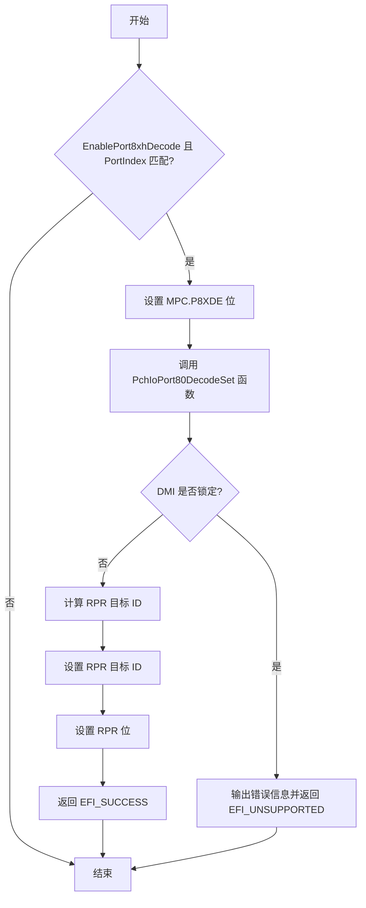

问题现象： 
	PCIe X1 多媒体设备找不到（X1采集卡 SV2000E），其他设备可以找到
	
根本原因：
	BIOS设置PCIDebug port为X1之后

```C
    oneof varid   = PCH_SETUP.PcieRootPort8xhDecode,
      prompt      = STRING_TOKEN(STR_PCH_PCIE_PORT8XH_PROMPT),
      help        = STRING_TOKEN(STR_PCH_PCIE_PORT8XH_HELP),
      default     = PCH_PCIE_PORT8XH,
      default     = PCH_PCIE_PORT8XH, defaultstore = AmiMfgDefault,\
      option text = STRING_TOKEN(STR_DISABLED), value = 0, flags = RESET_REQUIRED;
      option text = STRING_TOKEN(STR_ENABLED), value = 1, flags = RESET_REQUIRED;
    endoneof;

    suppressif ideqval PCH_SETUP.PcieRootPort8xhDecode == 0;
      numeric varid = PCH_SETUP.Pcie8xhDecodePortIndex,
        prompt      = STRING_TOKEN (STR_PCH_PCIE_PORT8XH_PORT_PROMPT),
        help        = STRING_TOKEN (STR_PCH_PCIE_PORT8XH_PORT_HELP),
        flags       = RESET_REQUIRED,
        minimum     = 0,
        maximum     = 27,
        step        = 1,    // Stepping of 0 equates to a manual entering of a value, otherwise it will auto-increment with a left/right arrow
        default     = PCH_PCIE_PORT8XH_PORT_DEFAULT,    // PCIe Port0 as default
      endnumeric;
    endif;
```

```C
  ///
  /// PCH BIOS Spec Section 8.10 PCI Bus Emulation & Port80 Decode Support
  /// The I/O cycles within the 80h-8Fh range can be explicitly claimed
  /// by the PCIe RP by setting MPC.P8XDE, PCI offset D8h[26] = 1 (using byte access)
  /// BIOS must also configure the corresponding DMI registers GCS.RPR and GCS.RPRDID
  /// to enable DMI to forward the Port8x cycles to the corresponding PCIe RP
  ///
  if (PchPcieConfig->PcieCommonConfig.EnablePort8xhDecode && ((PortIndex + 1) == (UINT8)PchPcieConfig->PchPciePort8xhDecodePortIndex)) {
    PciSegmentOr8 (RpBase + R_PCH_PCIE_CFG_MPC + 3, (UINT8) (B_PCH_PCIE_CFG_MPC_P8XDE >> 24));
    PchIoPort80DecodeSet (PortIndex);
  }
```

```C
/**
  Set PCH IO port 80h cycle decoding to PCIE root port.
  System BIOS is likely to do this very soon after reset before PCI bus enumeration.
  This cycle decoding is allowed to set when DMI is unlocked
  @param[in] RpNumber                PCIE root port physical number.
  @retval EFI_SUCCESS                   Successfully completed.
**/
EFI_STATUS
PchIoPort80DecodeSet (
  IN  UINTN                             RpNumber
  )
{
  EFI_STATUS  Status;
  Status = PchDmiSetIoPort80Decode (RpNumber);
  ASSERT_EFI_ERROR (Status);
  return Status;
}

/**
  Set PCH IO port 80h cycle decoding to PCIE root port in DMI
  @param[in] RpNumber                   PCIE root port physical number.
  @retval EFI_SUCCESS                   Successfully completed.
**/
EFI_STATUS
PchDmiSetIoPort80Decode (
  IN  UINTN                             RpNumber
  )
{
  UINT16            DmiRpDestinationId;
  PSF_PORT_DEST_ID  PsfRpDestinationId;
  
  if (IsPchDmiLocked ()) {
    DEBUG ((DEBUG_ERROR, "PchIoPort80DecodeSet Error. DMI is locked.\n"));
    ASSERT (FALSE);
    return EFI_UNSUPPORTED;
  }

  ///
  /// IO port 80h is typically used by decoder/LED hardware for debug purposes.
  /// By default PCH will forward IO port 80h cycles to LPC bus. The Reserved Page Route (RPR) bit
  /// of General Control and Status register, located at PCR[DMI] + 274Ch[11] , allows software to
  /// re-direct IO port 80h cycles to PCIe bus so that a target (for example, a debug card) on
  /// PCIe bus can receive and claim these cycles.
  /// The "RPR Destination ID", PCR[DMI] + 274Ch[31:16] need to be set accordingly to point
  /// to the root port that decode this range. Reading from Port 80h may not return valid values
  /// if the POST-card itself do not shadow the writes. Unlike LPC, PCIe does not shadow the Port 80 writes.
  ///

  PsfRpDestinationId = PsfPcieDestinationId ((UINT32)RpNumber);
  
  DmiRpDestinationId = (UINT16)((0x2 << 12) |(PsfRpDestinationId.Fields.PsfId << 8) |(PsfRpDestinationId.Fields.PortGroupId << 7) |(PsfRpDestinationId.Fields.PortId << 3) |  PsfRpDestinationId.Fields.ChannelId);

  //
  // Program "RPR Destination ID", PCR[DMI] + 274Ch[31:16] to the Dest ID of RP.
  //
  PchPcrWrite16 (PID_DMI, R_PCH_DMI_PCR_GCS + 2, DmiRpDestinationId);
  //
  // Program "Reserved Page Route", PCR[DMI] + 274Ch[11] to '1'.
  // Use byte write on GCS+1 and leave the BILD bit which is RWO.
  //
  PchPcrAndThenOr8 (PID_DMI, R_PCH_DMI_PCR_GCS + 1, 0xFF, (B_PCH_DMI_PCR_RPR >> 8));
  return EFI_SUCCESS;
}
```


### 分步解析：`PchDmiSetIoPort80Decode`函数实现

#### 一、函数目标
将**Port 80h的I/O周期解码路由到指定PCIe根端口**，取代默认的LPC总线转发，用于支持PCIe调试设备捕获POST码。

---

#### 二、代码逻辑分解

##### 1. **检查DMI锁定状态**
```c
if (IsPchDmiLocked ()) {
  DEBUG ((DEBUG_ERROR, "PchIoPort80DecodeSet Error. DMI is locked.\n"));
  ASSERT (FALSE);
  return EFI_UNSUPPORTED;
}
```
- **目的**：确保DMI寄存器可写入。
- **关键点**：DMI锁定后禁止修改关键寄存器（如GCS），此检查防止非法操作。

---

##### 2. **构造目标ID（DmiRpDestinationId）**
```c
PsfRpDestinationId = PsfPcieDestinationId ((UINT32)RpNumber);

DmiRpDestinationId = (UINT16)((0x2 << 12) |
                              (PsfRpDestinationId.Fields.PsfId << 8) |
                              (PsfRpDestinationId.Fields.PortGroupId << 7) |
                              (PsfRpDestinationId.Fields.PortId << 3) |
                               PsfRpDestinationId.Fields.ChannelId);
```
- **步骤解析**：
  - **`PsfPcieDestinationId`函数**：将根端口物理编号（RpNumber）转换为PSF目标ID结构体，包含以下字段：
    - **PsfId**：平台控制器Hub（PCH）内部总线标识。
    - **PortGroupId**：端口组编号（多端口共享资源的分组）。
    - **PortId**：根端口的物理索引。
    - **ChannelId**：通道编号（用于多通道设备）。
  - **目标ID编码规则**：
    - **0x2 << 12**：固定路由类型（0x2表示PCIe根端口路由）。
    - **PsfId << 8**：占据位12-15，标识目标PCH内部总线。
    - **PortGroupId << 7**：位8-11，端口组编号（左移7位因后续字段占用低位）。
    - **PortId << 3**：位4-7，根端口的物理索引。
    - **ChannelId**：位0-2，通道编号。

---

##### 3. **写入DMI寄存器**
```c
// 写入目标ID至高16位（GCS[31:16]）
PchPcrWrite16 (PID_DMI, R_PCH_DMI_PCR_GCS + 2, DmiRpDestinationId);

// 设置RPR位（GCS[11]）
PchPcrAndThenOr8 (PID_DMI, R_PCH_DMI_PCR_GCS + 1, 0xFF, (B_PCH_DMI_PCR_RPR >> 8));
```
- **寄存器地址**：
  - **R_PCH_DMI_PCR_GCS**：DMI的通用控制状态寄存器（GCS），偏移0x274C。
  - **高16位写入**：`R_PCH_DMI_PCR_GCS + 2`指向偏移0x274E，对应GCS[31:16]。
  - **RPR位操作**：`R_PCH_DMI_PCR_GCS + 1`指向偏移0x274D，通过8位写入操作设置第3位（GCS[11]对应字节偏移+1的第3位）。

---

#### 三、技术背景与硬件交互

##### 1. **DMI寄存器结构**
| 寄存器字段         | 偏移   | 位域       | 功能描述                     |
|--------------------|--------|------------|------------------------------|
| **GCS.RPRDID**     | 274Eh  | [31:16]    | 目标PCIe根端口的PSF ID编码    |
| **GCS.RPR**        | 274Ch  | Bit 11     | 置1时启用Port80h到PCIe的路由 |

---

##### 2. **PSF目标ID编码示例**
假设RpNumber对应：
- **PsfId = 0x1**（PCH内部总线1）
- **PortGroupId = 0x0**（组0）
- **PortId = 0x3**（根端口3）
- **ChannelId = 0x2**（通道2）

编码结果：
```
0x2 << 12                → 0x2000
PsfId (0x1) << 8         → 0x0100
PortGroupId (0x0) << 7   → 0x0000
PortId (0x3) << 3        → 0x0018
ChannelId (0x2)          → 0x0002
最终DmiRpDestinationId = 0x2000 | 0x0100 | 0x0018 | 0x0002 = 0x211A
```
写入GCS[31:16]的值为0x211A，系统据此将Port80h周期路由至目标根端口。

---

##### 3. **硬件信号流**
1. **CPU发出Port80h写操作**：POST阶段代码写入Port80h调试码。
2. **DMI总线捕获请求**：GCS.RPR=1时，DMI拦截该I/O周期。
3. **路由至PCIe根端口**：根据GCS.RPRDID中的PSF ID，将请求转发至目标根端口。
4. **PCIe设备响应**：根端口下游设备（如调试卡）接收并处理该周期。

---

> MPC.P8XDE
![[Pasted image 20250325095540.png]]
