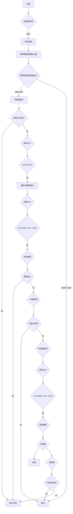
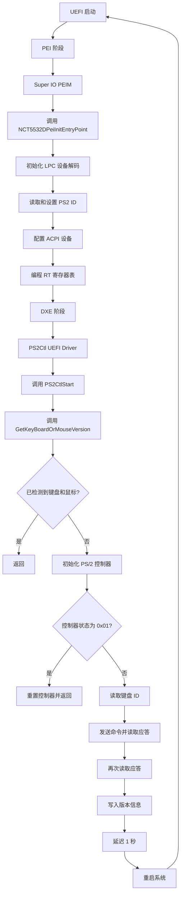

2023/10/24 17:40:29

键盘和鼠标控制器

        键盘和鼠标作为电脑的基础输入设备。由于键盘的按键数量庞大，从而无法像单片机的按键那样通过微动开关和去抖动电路，直接将其连接到处理器（或中断控制器）的中断请求引脚。同理，鼠标设备也不能使用这种方式向处理器发送数据，它们都必须借助控制器才能向处理器发送中断请求和数据。

        对于现代电脑，其主板中都集成有Intel 8042键盘控制器或兼容芯片，该芯片不光用于控制键盘设备，还控制着A20地址线的开启，系统重启及操作鼠标控制器等功能。

        上图涵盖了Intel 8042键盘控制器支持的常用功能，大体上可分为8042控制器，键盘控制器（PS/2接口），鼠标控制器（PS/2接口）三部分。下面将对它们逐一讲解。

        1.Intel 8042键盘控制器

        Intel 8042键盘控制器除了可与键盘鼠标外设进行交互外，还拥有几组用于控制诸如A20地址线，系统重启，屏幕颜色，扩展内存等功能的引脚，通过I/O端口0x60和0x64可访问8042键盘控制器，进而管理这些功能。

        1.1.Intel 8042键盘控制器的操作端口

        端口0x60和0x64都是1B的双向读写I/O端口地址，它们不光可向Intel 8042键盘控制器发送数据，还可向键盘发送数据。由于I/O端口的数据位宽有限，因此，不管是控制Intel 8042键盘控制器，还是控制键盘鼠标，都需采用命令加参数的通信方式。

|      |     |       |                                                                                                                                                                                                                                                                          |
| ---- | --- | ----- | ------------------------------------------------------------------------------------------------------------------------------------------------------------------------------------------------------------------------------------------------------------------------ |
| 端口   | 读写  | 名称    | 功能描述                                                                                                                                                                                                                                                                     |
| 0x60 | 读   | 输出缓冲区 | 返回键盘扫描码或8042键盘控制器发来的数据                                                                                                                                                                                                                                                   |
| 0x60 | 写   | 输入缓冲区 | 可向键盘发送命令（如命令带参数，随后再向该端口发送参数），或向8042键盘控制器发送命令参数                                                                                                                                                                                                                           |
| 0x64 | 读   | 控制器状态 | 返回8042键盘控制器的状态，其各位功能描述如下：<br><br>bit 7=1：说明与键盘通信时发生奇偶校验错误<br><br>bit 6=1：说明接收键盘数据超时<br><br>bit 5=1:说明鼠标输出缓冲区已满<br><br>bit 4=0：禁止键盘<br><br>bit 3：记录上次操作的端口号（键盘控制器内部使用），1为0x64端口，0为0x60端口。<br><br>bit 2=1：说明控制器已完成自检<br><br>bit 1=1：说明键盘输入缓冲区已满<br><br>bit 0=1：说明键盘输出缓冲区已满 |
| 0x64 | 写   | 控制器命令 | 向8042键盘控制器发送控制命令                                                                                                                                                                                                                                                         |

        1.2.Intel 8042键盘控制器的控制命令

        系统可通过向I/O端口0x64发送1B的控制命令操作8042键盘控制器，如该命令需附加参数，则再向I/O端口0x60发送命令数值。对某些返回应答数据的控制命令，其应答数据将发往端口0x60。

        下表已列举出常用的控制命令，其中就包括用于控制鼠标的D4h命令，控制外围端口的输入输出命令及测试端口命令。

|     |     |     |                                                                                                                                                                                                                                                  |
| --- | --- | --- | ------------------------------------------------------------------------------------------------------------------------------------------------------------------------------------------------------------------------------------------------ |
| 命令  | 参数  | 返回值 | 功能描述                                                                                                                                                                                                                                             |
| 20h | 无   | 有   | 读取键盘的配置值                                                                                                                                                                                                                                         |
| 60h | 有   | 无   | 向键盘发送配置命令，配置值（参数）各位的功能如下。<br><br>bit 7=0：0<br><br>bit 6=1：在扫描码存入输入缓存区前，将其转换为第一套扫描码。<br><br>bit 5=0：使能鼠标设备<br><br>bit 4=0：使能键盘设备<br><br>bit 3=0：0<br><br>bit 2=1：通知系统已完成热启动测试及初始化<br><br>bit 1=1：使能鼠标中断IRQ12（MIBF）<br><br>bit 0=1：使能键盘中断IRQ1（IBF） |
| A7h | 无   | 无   | 禁止鼠标端口                                                                                                                                                                                                                                           |
| A8h | 无   | 无   | 开启鼠标端口                                                                                                                                                                                                                                           |
| A9h | 无   | 有   | 鼠标端口自检测试，返回值00h表示正常                                                                                                                                                                                                                              |
| AAh | 无   | 有   | 控制器自检测试，返回值55h表示正常                                                                                                                                                                                                                               |
| ABh | 无   | 有   | 键盘端口自检测试，返回值00h表示正常                                                                                                                                                                                                                              |
| ADh | 无   | 无   | 禁止键盘通信，自动复位控制器状态的第4位                                                                                                                                                                                                                             |
| AEh | 无   | 无   | 开启键盘通信，自动置位控制器状态的第4位                                                                                                                                                                                                                             |
| C0h | 无   | 有   | 读输入端口P1                                                                                                                                                                                                                                          |
| D0h | 无   | 有   | 读输出端口P2                                                                                                                                                                                                                                          |
| D1h | 有   | 无   | 写输出端口P2                                                                                                                                                                                                                                          |
| D2h | 有   | 无   | 把参数写入到键盘缓冲区，就如同从键盘收到数据一样                                                                                                                                                                                                                         |
| D3h | 有   | 无   | 把参数写入到鼠标缓冲区，就如同从鼠标收到数据一样                                                                                                                                                                                                                         |
| D4h | 有   | 无   | 向鼠标设备发送数据                                                                                                                                                                                                                                        |
| E0h | 无   | 无   | 读测试端口P3                                                                                                                                                                                                                                          |
| FEh | 无   | 无   | 系统重启                                                                                                                                                                                                                                             |

        在这些常用命令中，20h和60h命令是控制键盘鼠标必备的命令，而命令C0h,D0h,D1h,E0h则用于控制输入，输出及测试端口各引脚的状态值。这些引脚的功能各不相同。

|               |      |               |         |               |      |
| ------------- | ---- | ------------- | ------- | ------------- | ---- |
| 输入端口P1（Port1） |      | 输出端口P2（Port2） |         | 测试端口P3（Port3） |      |
| 引脚            | 功能描述 | 引脚            | 功能描述    | 引脚            | 功能描述 |
| 0             | 键盘数据 | 0             | 系统重启    | 0             | 键盘时钟 |
| 1             | 鼠标数据 | 1             | A20地址线  | 1             | 键盘数据 |
| 2             |      | 2             | 鼠标数据    | 2             |      |
| 3             |      | 3             | 鼠标时钟    | 3             |      |
| 4             |      | 4             | 键盘IBF中断 | 4             |      |
| 5             |      | 5             | 鼠标IBF中断 | 5             |      |
| 6             |      | 6             | 键盘时钟    | 6             |      |
| 7             |      | 7             | 键盘数据    | 7             |      |

        在这些端口引脚中，本系统可能会用到Port2端口的Pin0和Pin1引脚，剩余引脚使用频率非常低。这两个引脚分别控制着系统重启功能和A20地址线。

        1.3.A20地址线功能

        第4章就已经对A20地址线的作用和开启方法进行了讲解，并用代码实现了一种快速开启A20地址线的方式。此处通过拉高Port2端口Pin1引脚的电平来开启A20地址线的方式，在执行速度方面相对较慢，这种开启方式仅供读者参数。

        1.4.系统重启方式

        通过拉低Port2端口的Pin0引脚可使系统重启，或向I/O端口0x64发送控制命令FEh来重启系统。

        2.键盘控制器

        键盘是计算机的一种重要输入设备，它的工作原理是通过类8048键盘编码器芯片不停地扫描键盘上的每一个按键，一旦发现有按键被按下或抬起，8048键盘编码器芯片便立即将按键对应的键盘扫描码发送至类8042键盘控制器。而类8042键盘控制器会将数据解析后保存到输入缓冲区中，并触发键盘按键中断请求。

        8048键盘编码器芯片共定义三套不同格式的键盘扫描码，现代键盘默认采用第二套键盘扫描码，但为了兼容以前的XT键盘，8042键盘控制器在接收到键盘扫描码后，都默认将其转换为第一套键盘扫描码。通过向I/O端口0x60发送键盘命令可修改默认的键盘扫描码。

        2.1.键盘命令

        Intel 8042键盘控制器为我们准备了丰富的键盘控制命令，这些命令依然通过I/O端口0x60发往键盘控制器。如命令需携带参数，则紧随命令之后参数再写入到0x60端口，一些键盘命令会在执行后回送应答数据（0xFA）。

|     |     |     |                                                                                                                 |
| --- | --- | --- | --------------------------------------------------------------------------------------------------------------- |
| 命令  | 参数  | 返回值 | 功能描述                                                                                                            |
| FFh | 无   | 有   | 重启键盘                                                                                                            |
| FEh | 无   | 无   | 重新发送上一字节                                                                                                        |
| F6h | 无   | 无   | 使用默认按键速率                                                                                                        |
| F5h | 无   | 无   | 停止键盘扫描                                                                                                          |
| F4h | 无   | 无   | 开启键盘扫描                                                                                                          |
| F3h | 有   | 无   | 设置按键速率                                                                                                          |
| F2h | 无   | 有   | 获取键盘的设备ID号(2B)                                                                                                  |
| F0h | 有   | 无   | 设置键盘使用的扫描码集，可用参数值如下：<br><br>0x0：取得当前扫描码（有返回值）<br><br>0x1：代表第一套扫描码<br><br>0x2：代表第二套扫描码<br><br>0x3：代表第三套扫描码       |
| EEh | 无   | 有   | 键盘回复EEh                                                                                                         |
| EDh | 有   | 无   | 控制LED灯亮灭，参数各位功能说明如下：<br><br>位2：Caps Lock灯1（亮）、0（灭）<br><br>位1：Num Lock灯1（亮）、0（灭）<br><br>位0：Scroll Lock灯1（亮）、0（灭） |

        2.2.键盘扫描码

        XT型键盘使用的键盘扫描码称为第一套键盘扫描码，它仅使用1B数据就描述了绝大部分按键的按下与抬起状态。相比下，第二套和第三套键盘扫描码需更多数据来描述按键状态。鉴于第一套键盘扫描码数据量小，便于解析，且键盘控制器在默认下仍将接收到的数据转换为第一套键盘扫描码，所以本系统也采用第一套键盘扫描码来描述按键状态。

        3.鼠标控制器

        鼠标和键盘都被接入到键盘控制器的PS/2接口上，由此可见，鼠标设备的控制方法与键盘设备类似。在之前表列出的键盘控制器命令中，已经提供了向鼠标设备发送数据的控制命令D4h，通过向I/O端口0x64发送控制命令D4h，8042键盘控制器就可将I/O端口0x60保存的鼠标控制命令发送至鼠标设备。

        3.1.鼠标控制命令

        Intel 8042键盘控制器同样为我们准备了丰富的鼠标控制命令。大部分鼠标控制命令在执行结束后都会向8042键盘控制器发送应答数据（0xFA）。

|     |      |       |                  |                          |                    |         |       |       |
| --- | ---- | ----- | ---------------- | ------------------------ | ------------------ | ------- | ----- | ----- |
| KEY | MAKE | BREAK | KEY              | MAKE                     | BREAK              | KEY     | MAKE  | BREAK |
| A   | 1E   | 9E    | 9                | 0A                       | 8A                 | [       | 1A    | 9A    |
| B   | 30   | B0    | '                | 29                       | A9                 | INSERT  | E0,52 | E0,D2 |
| C   | 2E   | AE    | -                | 0C                       | 8C                 | HOME    | E0,47 | E0,C7 |
| D   | 20   | A0    | =                | 0D                       | 8D                 | PG UP   | E0,49 | E0,C9 |
| E   | 12   | 92    | \|2B             | AB                       | DELETE             | E0,53   | E0,D3 |       |
| F   | 21   | A1    | BKSP             | 0E                       | 8E                 | END     | E0,4F | E0,CF |
| G   | 22   | A2    | SPACE            | 39                       | B9                 | PG DN   | E0,51 | E0,D1 |
| H   | 23   | A3    | TAB              | 0F                       | 8F                 | U ARROW | E0,48 | E0,C8 |
| I   | 17   | 97    | CAPS             | 3A                       | BA                 | L ARROW | E0,4B | E0,CB |
| J   | 24   | A4    | L SHFT           | 2A                       | AA                 | D ARROW | E0,50 | E0,D0 |
| K   | 25   | A5    | L CTRL           | 1D                       | 9D                 | R ARROW | E0,4D | E0,CD |
| L   | 26   | A6    | L GUI            | E0,5B                    | E0,DB              | NUM     | 45    | C5    |
| M   | 32   | B2    | L ALT            | 38                       | B8                 | KP/     | E0,35 | E0,B5 |
| N   | 31   | B1    | R SHFT           | 36                       | B6                 | KP*     | 37    | B7    |
| O   | 18   | 98    | R CTRL           | E0,1D                    | E0,9D              | KP-     | 4A    | CA    |
| P   | 19   | 99    | R GUI            | E0,5C                    | E0,DC              | KP+     | 4E    | CE    |
| Q   | 10   | 90    | R ALT            | E0,38                    | E0,B8              | KP EN   | E0,1C | E0,9C |
| R   | 13   | 93    | APPS             | E0,5D                    | E0,DD              | KP.     | 53    | D3    |
| S   | 1F   | 9F    | ENTER            | 1C                       | 9C                 | KP 0    | 52    | D2    |
| T   | 14   | 94    | ESC              | 01                       | 81                 | KP 1    | 4F    | CF    |
| U   | 16   | 96    | F1               | 3B                       | BB                 | KP 2    | 3F    | CF    |
| V   | 2F   | AF    | F2               | 3C                       | BC                 | KP 3    | 51    | D1    |
| W   | 11   | 91    | F3               | 3D                       | BD                 | KP 4    | 4B    | CB    |
| X   | 2D   | AD    | F4               | 3E                       | BE                 | KP 5    | 4C    | CC    |
| Y   | 15   | 95    | F5               | 3F                       | BF                 | KP 6    | 4D    | CD    |
| Z   | 2C   | AC    | F6               | 40                       | C0                 | KP 7    | 47    | C7    |
| 0   | 0B   | 8B    | F7               | 41                       | C1                 | KP 8    | 48    | C8    |
| 1   | 02   | 82    | F8               | 42                       | C2                 | KP 9    | 49    | C9    |
| 2   | 03   | 83    | F9               | 43                       | C3                 | ]       | 1B    | 9B    |
| 3   | 04   | 84    | F10              | 44                       | C4                 | ;       | 27    | A7    |
| 4   | 05   | 85    | F11              | 57                       | D7                 | '       | 28    | A8    |
| 5   | 06   | 86    | F12              | 58                       | D8                 | .       | 33    | B3    |
| 6   | 07   | 87    | PRNT<br><br>SCRN | E0,2A<br><br>E0,37       | E0,B7<br><br>E0,AA | .       | 34    | B4    |
| 7   | 08   | 88    | SCROLL           | 46                       | C6                 | /       | 35    | B5    |
| 8   | 09   | 89    | PAUSE            | E1,1D,45<br><br>E1,9D,C5 | -                  | -       | -     | -     |

|     |                            |
| --- | -------------------------- |
| 命令  | 功能描述                       |
| FFh | 重启鼠标                       |
| FEh | 重新发送上一条数据包                 |
| F6h | 使用默认采样率100hZ,分辨率4 pixel/mm |
| F5h | 禁止鼠标设备发送数据包                |
| F4h | 允许鼠标设备发送数据包                |
| F3h | 设置鼠标采样率                    |
| F2h | 获得鼠标设备的ID号                 |
|     |                            |
|     |                            |

        3.2.鼠标数据包格式

        与键盘设备不同，鼠标设备上报的数据并非键盘扫描码，而是一个数据包。数据包记录着鼠标移动轨迹和当前按键状态， 数据包根据鼠标设备的ID号可进一步分为3B和4B两种数据包。当鼠标设备的ID号为3或4时，鼠标设备才会发送第4字节数据，但大部分鼠标设备的ID号为0。

Byte1: Y溢出 X溢出 Y符号位 X符号位 1 鼠标中键 鼠标右键 鼠标左键

Byte2: X移动值

Byte3: Y移动值

Byte4: Z移动值                                                                                                ID值为3

Byte5: 0 0 鼠标第5键 鼠标第4键 Z3 Z2 Z1 Z0                                                ID值为4

        从上表可知，4B数据包还可根据鼠标设备ID号详细分为两种格式。当鼠标设备的ID号为3时，数据包的第4字节记录着鼠标垂直滚轮的移动值（Z移动值）；当鼠标设备的ID号为4时，数据包的第4字节记录着鼠标扩展按键状态（第4/5按键）和滚轮移动值（Z0~3）。

|   |   |
|---|---|
|名称|功能描述|
|X/Y溢出|表示X或Y方向数值溢出，并丢弃整个数据包|
|X/Y符号位|表示鼠标在平面直角坐标系内的移动方向|
|X/Y/Z移动值|记录X,Y或Z方向的移动值|
|左/中/右/第4/第5按键|记录鼠标按键状态|
|Z0~3|记录鼠标滚轮滚动方向|

        上表的X/Y表示鼠标相对上一个采集点的移动方向和距离，它们皆是由符号位和移动值组成的9位二进制补码，符号位代表移动方向。而Z表示鼠标滚轮的滚动方向和距离，其表示方法与X/Y相同，下表描述了水平滚轮和垂直滚轮的4个滚动方向。

|   |   |
|---|---|
|Z0~3|功能描述|
|0|无滚动|
|1|垂直向上滚动|
|F|垂直向下滚动|
|2|水平向右滚动|
|E|水平向左滚动|

        鼠标双击不是硬件逻辑，而是借助软件逻辑实现的。

完善键盘驱动

        1.键盘初始化函数

        编写设备驱动程序前，通常会为设备驱动定义一系列结构体来描述设备的独有特性，键盘驱动程序也不例外。首先为键盘设备定义结构体来描述它的独有特性，并定义一些宏常量使操作寄存器的过程更易于理解。

        struct keyboard_inputbuffer便是此次用于描述键盘设备的结构体。

        这个结构体为键盘设备定义了一个100B的循环队列缓冲区，缓冲区首尾指针及缓冲数据计数器。代码还为键盘驱动程序准备了一些便于理解的宏常量，以提升驱动程序的可读性。

        代码定义了键盘控制器的I/O端口，命令，及初始数值等相关宏常量。

|                 |      |                                                                                                                                                                                                                                               |
| --------------- | ---- | --------------------------------------------------------------------------------------------------------------------------------------------------------------------------------------------------------------------------------------------- |
| 宏常量名            | 数值   | 功能描述                                                                                                                                                                                                                                          |
| PORT_KB_DATA    | 0x60 | I/O端口0x60                                                                                                                                                                                                                                     |
| PORT_KB_STATUS  | 0x64 | I/O端口0x64                                                                                                                                                                                                                                     |
| PORT_KB_CMD     | 0x64 | I/O端口0x64                                                                                                                                                                                                                                     |
| KBCMD_WRITE_CMD | 0x60 | 向键盘发送配置命令，KB_INIT_MODE是命令参数                                                                                                                                                                                                                   |
| KBCMD_READ_CMD  | 0x20 | 读取键盘的配置值                                                                                                                                                                                                                                      |
| KB_INIT_MODE    | 0x47 | 发往键盘的配置值，其各位的设置状态如下：<br><br>bit 7=0：0<br><br>bit 6=1: 在扫描码存入输入缓存区前，将其转换为第一套扫描码<br><br>bit 5=0: 使能鼠标<br><br>bit 4=0: 使能键盘<br><br>bit 3=0: 0<br><br>bit 2=1: 通知系统已完成热启动测试及初始化<br><br>bit 1=1: 使能鼠标中断IRQ12(M!BF)<br><br>bit 0=1: 使能键盘中断IRQ1(IBF) |

        除此之外，还定义了一对宏函数来检测输入/输出缓冲区是否已满，检测方法是读取I/O端口0x64的控制器状态位。

        此番准备后，就实现键盘的初始化（挂载）函数keyboard_init。键盘的初始化过程不光需要对键盘控制器进行配置，还需对I/O APIC的I/O中断定向投递寄存器（RTE表项）进行配置。

        程序起始处，定义了一些全局变量。用于记录功能键的按键状态，这些全局变量会在keyboard_init函数中被初始化。函数keyboard_init的首要任务是动态创建struct keyboard_inputbuffer结构体的存储空间，并对其进行初始化赋值。

        随后，再对I/O APIC的RTE1表项进行配置，进而将键盘设备的中断请求投递至Local APIC ID为0的处理器核心（BSP处理器）中。

        紧接着，通过向键盘控制器发送控制命令使能键盘设备和IRQ1中断请求。此处，还使能了鼠标设备及IRQ12中断请求。由于现在鼠标设备对应的RTE表项寄存器仍处于屏蔽状态，因此不会响应鼠标发出的中断请求。接下来的一百万次无操作（nop宏函数封装着汇编指令NOP，即无操作指令）循环只是为了拖延时间，使低速的键盘控制器把控制命令执行完。最后，调register_irq函数向系统注册键盘设备的中断处理程序。

        虽然本系统目前无法实现驱动程序的动态挂载与卸载，但驱动卸载函数作为驱动程序的一部分是必不可少的。

        卸载过程非常简单，只需调中断注销函数，再释放struct keyboard_inputbuffer。

        关于注册键盘中断处理程序时使用的中断处理接口keyboard_int_controller，它是采用此前已编写好的操作接口封装而成的。

·        2.键盘中断处理函数

         在键盘驱动初始化函数中，还有一个函数未介绍。那就是键盘中断处理函数（中断上半部处理函数）。键盘中断处理函数的主要任务是从I/O端口0x60读取键盘扫描码，并将其存入struct keyboard_inputbuffer结构体内的循环队列缓冲区，再调整循环队列缓冲区首尾指针及缓冲区计数器。

        至此，键盘驱动程序已基本实现。下面对do_IRQ进行调整。

        3.键盘扫描码解析函数

        如此刻测试键盘驱动程序，内核只能打印出键盘扫描码。根据前文，我们只有解析了键盘扫描码后，才能分辨出按键字符。现在去实现键盘扫描码解析函数。

        为了让键盘扫描码解析函数可快速检索出扫描码的按键，特将键盘扫描码归纳为三类，第一类是以0xE1开头的PauseBreak键，第二类是以0xE0开头的功能键，第三类是1B普通按键。

        再实现键盘扫描码解析函数前，依然要定义一些宏常量。

        在这些宏常量中，NR_SCAN_CODES*MAP_COLS描述了一个由第三类键盘扫描码组成的一维数组的长度，共128个按键，每个按键包含普通按键和Shift加普通按键两种状态；宏常量PAUSEBREAK，PRINTSCREEN和OTHERKEY表示第一类和第二类特殊按键。

        一维数组keycode_map_normal里的按键字符是根据键盘扫描码值升序排列到数组中，而数组pausebreak_scode值保存着PauseBreak键的扫描码值。

        此刻，解析键盘扫描码的绝大部分准备工作已经就绪，马上进入键盘扫描码解析函数analysis_keycode的实现。

        键盘扫描码解析函数入口部分，它先为几个局部变量开辟了栈存储空间，再通过get_scancode从键盘循环队列缓冲区中读取1B数据到局部变量x中，并对局部变量x的数值进行判断。

        当局部变量x的数值为0xE1时，则继续从键盘循环队列缓冲区中读取数据，并与第一类键盘扫描码数组中的元素进行逐个比对，如数值完全相同，就认为PauseBreak键被按下。如局部变量x的数值不为0xE1，则继续检索其他两类键盘扫描码。

        代码中的get_scancode函数通过读取键盘驱动程序的循环队列缓冲区，将中断处理函数捕获的键盘扫描码传递给键盘扫描码解析函数。

        如循环队列缓冲区为空，则等待键盘发送数据。否则从循环队列缓冲区中读取1B数据返回给函数调用者，并在函数返回前调整缓冲区首尾指针及缓冲区计数器。

        既然按键不属于第一类键盘扫描码，则通过代码检测按键是否属于第二类键盘扫描码，其检测过程依然采用逐个字节匹配法。

        代码只对Print Screen，Right Ctrl，Right Alt三个第二类键盘扫描码进行检测，其他按键暂时忽略。如检测出相匹配的键盘扫描码，则用key, ctrl_r或alt_r变量进行记录。如局部变量x的数值也不属于第二类键盘扫描码，则继续检索第三类键盘扫描码。

        代码先判断局部变量key的数值，以确定其是否与第一类或第二类键盘扫描码匹配成功，如未匹配成功，则通过本段程序与第三类键盘扫描码匹配。

keyboardSwap( )




```C
// <AMI_PHDR_START>
//-------------------------------------------------------------------------
//
// Procedure: SioPeiInitEntryPoint
//
// Description:
//  This function provide PEI phase SIO initialization
//
// Input:
//  IN  EFI_FFS_FILE_HEADER    *FfsHeader - Logical Device's information
//  IN  EFI_PEI_SERVICES       **PeiServices  - Read/Write PCI config space
//
// Output:    None
//
// Modified:  Nothing
//
// Referrals: None
//
// Note:
//-------------------------------------------------------------------------
// <AMI_PHDR_END>
EFI_STATUS NCT5532DPeiInitEntryPoint(
        IN       EFI_PEI_FILE_HANDLE  FileHandle,
        IN CONST EFI_PEI_SERVICES     **PeiServices
)
{
    UINT8 index;
    UINT8 ACPI0xE0Value=0,NewACPI0xE0Value=0;
    UINT8 PS2ID=0;
    UINT8 IsMouse=BIT2;

    for(index=0; index<sizeof(NCT5532DPeiDecodeTable)/sizeof(IO_DECODE_DATA); index++)
        AmiSioLibSetLpcDeviceDecoding(NULL, NCT5532DPeiDecodeTable[index].BaseAdd, NCT5532DPeiDecodeTable[index].UID, NCT5532DPeiDecodeTable[index].Type);

    //The PS2 inferface is conected to a mouse
    IoWrite8(0x72,0x62);
    PS2ID=IoRead8(0x73);
    if (PS2ID!=0xFF)
    {
        IoWrite8(0x72,0x64);
        IoWrite8(0x73,PS2ID);
    }
    
    if (PS2ID==0x00)
    {
        IsMouse|=BIT2;
        IoWrite8(0x72,0x63);
        IoWrite8(0x73,0x01);
        
        IoWrite8(0x72,0x62);
        IoWrite8(0x73,0xFF);

    }else if (PS2ID==0xAB)
    {
        IsMouse=0;
        IoWrite8(0x72,0x63);
        IoWrite8(0x73,0x01);

        IoWrite8(0x72,0x62);
        IoWrite8(0x73,0xFF);
    }

    //Enter to congig mode
    IoWrite8(NCT5532D_CONFIG_INDEX,NCT5532D_CONFIG_MODE_ENTER_VALUE);
    IoWrite8(NCT5532D_CONFIG_INDEX,NCT5532D_CONFIG_MODE_ENTER_VALUE);
    //Select ACPI device
    IoWrite8(NCT5532D_CONFIG_INDEX,NCT5532D_LDN_SEL_REGISTER);
    IoWrite8(NCT5532D_CONFIG_DATA,NCT5532D_LDN_ACPI);
    //Check 0xE0 status
    IoWrite8(NCT5532D_CONFIG_INDEX,0xE0);
    ACPI0xE0Value=IoRead8(NCT5532D_CONFIG_INDEX);
    ACPI0xE0Value&=0x00;
    NewACPI0xE0Value=ACPI0xE0Value|IsMouse;
    //Write value to 0xE0
    IoWrite8(NCT5532D_CONFIG_INDEX,0xE0);
    IoWrite8(NCT5532D_CONFIG_DATA,NewACPI0xE0Value);
    
    //Exit config mode
    IoWrite8(NCT5532D_CONFIG_INDEX,NCT5532D_CONFIG_MODE_EXIT_VALUE);
    IoWrite8(0x72,0x65);
    IoWrite8(0x73,NewACPI0xE0Value);
    ProgramRtRegisterTable(0, NCT5532DPeiInitTable, sizeof(NCT5532DPeiInitTable)/sizeof(SIO_DEVICE_INIT_DATA));

    return EFI_SUCCESS;
}
```
```C
/**
    PS/2 Controller Driver Start function
    This function is a part of DriverBinfing protocol

    @param    *This                - Pointer to this instance of the driver binding protocol
              Controller           - Handle for this controller
              *RemainingDevicePath - Pointer to last node in device path

    @retval    EFI_STATUS Status of the operation

**/

EFI_STATUS 
EFIAPI 
PS2CtlStart (
    EFI_DRIVER_BINDING_PROTOCOL *This,
    EFI_HANDLE                  Controller,
    EFI_DEVICE_PATH_PROTOCOL    *RemainingDevicePath)
{
    ACPI_HID_DEVICE_PATH    *acpiDP;
    PS2DEV_TABLE            *ps2dev = 0;
    EFI_STATUS              Status;
    EFI_TPL                 OldTpl;

    // The following code performs the basic KBC initialization
    // It has to be executed only once, we use global variable
    // gDriverStartCounter to control this. Also, this code is
    // executed on a higher TPL to prevent re-entrance.
    OldTpl = gBS->RaiseTPL(TPL_NOTIFY);
    if (OldTpl > TPL_NOTIFY) return EFI_DEVICE_ERROR;
    
    while (!gDriverStartCounter) {
        // Disable the Keyboard IRQ if it's enabled before 
        // Finish all the Keyboard Initialization and Re-enable the IRQ again 
        if(KbRdBeforeInstall){
            mLegacy8259->DisableIrq( mLegacy8259, SYSTEM_KEYBOARD_IRQ );
            gKeyboardIrqInstall=FALSE;
        }
        // Initialize KBC hardware
        if ( KbcBasicAssuranceTest ) {
            Status = KBCBatTest();      // Perform KBC Basic Assurance Test
            if (EFI_ERROR(Status)) {
                // Report the Error code if the BAT test failed
                // ReportStatusCode (EFI_ERROR_CODE|EFI_ERROR_MAJOR,(EFI_PERIPHERAL_KEYBOARD | EFI_P_KEYBOARD_EC_STUCK_KEY));
                break;
            }

            // Check for stuck keys
            Status = IbFreeTimeout(IbFreeTimeoutValue);
            if (EFI_ERROR(Status)) {
                // Report the Error Code.
                // ReportStatusCode (EFI_ERROR_CODE|EFI_ERROR_MAJOR,(EFI_PERIPHERAL_KEYBOARD | EFI_P_KEYBOARD_EC_STUCK_KEY));
                break;
            }
        }
 
        GetKeyBoardOrMouseVersion();

        // Swap ports if needed
        if (AutodetectKbdMousePortsPtr!=NULL) AutodetectKbdMousePortsPtr();
    
        gDriverStartCounter++;
    }
    
    
    if(!EFI_ERROR(GetPS2_DP(This, Controller, &acpiDP, EFI_OPEN_PROTOCOL_BY_DRIVER)) &&
            LookupPs2Hid(supportedDevices, acpiDP->HID, acpiDP->UID, &ps2dev) ){
             Status = ps2dev->start(This, Controller);

            // End of critical section - restore TPL
             gBS->RestoreTPL(OldTpl);

            if(EFI_ERROR(Status)) {
                return EFI_DEVICE_ERROR;
            }

            return EFI_SUCCESS;
    } 
        
    // End of critical section - restore TPL
    gBS->RestoreTPL(OldTpl);

    // If control is here then something totally wrong happened:
    // if device is not supported then Start shouldn't be called.
    return EFI_DEVICE_ERROR;
}


VOID 
GetKeyBoardOrMouseVersion()
{

    UINT8 KMVersion = 0;
    if (Ps2KbdDetected&&Ps2MouseDetected)
    {
        return;
    }
    IoWrite8(0x72,0x63);
    if (IoRead8(0x73)==0x01)
    {
        IoWrite8(0x72,0x63);    
        IoWrite8(0x73,0xFF);
        return;
    }

    WriteKeyboardData(rKeyboardID); // Read KBD ID

    ObFullReadTimeout(&KMVersion, 1000, TRUE); // Read ACK

    WriteKeyboardCommand(0xD4);    
    WriteKeyboardData(rKeyboardID);
    ObFullReadTimeout(&KMVersion, 1000, TRUE); // Read ACK

    ObFullReadTimeout(&KMVersion, 100, TRUE);

    IoWrite8(0x72,0x62);
    IoWrite8(0x73,KMVersion);

    IoWrite8(0x80,0x2F);
    gBS->Stall(1000000); 
    
    IoWrite8(0xCF9,0x06);
}

```
1. **UEFI 启动**:
    
    - 进入 PEI 阶段。
2. **PEI 阶段**:
    
    - 执行 `Super IO PEIM`。
    - 调用 `NCT5532DPeiInitEntryPoint` 函数。
    - 初始化 LPC 设备解码。
    - 读取和设置 PS2 ID。
    - 配置 ACPI 设备。
    - 编程 RT 寄存器表。
3. **DXE 阶段**:
    
    - 调用 `GetKeyBoardOrMouseVersion` 函数。
    - 检查是否已检测到键盘和鼠标。
        - 如果已检测到，返回。
        - 如果未检测到，初始化 PS/2 控制器。
            - 检查控制器状态。
                - 如果状态为 0x01，重置控制器并返回。
                - 如果状态不为 0x01，读取键盘 ID。
                    - 发送命令并读取应答。
                    - 再次读取应答。
                    - 写入版本信息。
                    - 延迟 1 秒。
                    - 重启系统，重新进入 PEI 阶段。

```mermaid
gantt
    title 上海跨年旅游攻略甘特图
    dateFormat  HH:mm
    section 12月30日（周一）
    中午到达酒店 :a, 12:00, 1h
    南京路步行街小吃品尝 :after a, 13:00, 2h
    上海邮政博物馆参观 :after prev, 15:00, 1h
    乍浦路桥游览 :after prev, 16:00, 0.5h
    沙美大楼参观 :after prev, 16:30, 0.5h
    益丰外滩源游览 :after prev, 17:00, 1h
    万国建筑博览群漫步 :after prev, 18:00, 1h
    外滩夜景欣赏 :after prev, 19:00, 1.5h
    黄浦江游船夜游 :after prev, 20:30, 1.5h
    返回酒店休息 :after prev, 22:00, 0.5h

    section 12月31日（周二）
    全天迪士尼乐园游玩 :b, 08:00, 14h
    迪士尼城堡烟花表演 :after b, 21:00, 1h

    section 2025年1月1日（周三）
    下午返回深圳 :c, 14:00, 2h
```



